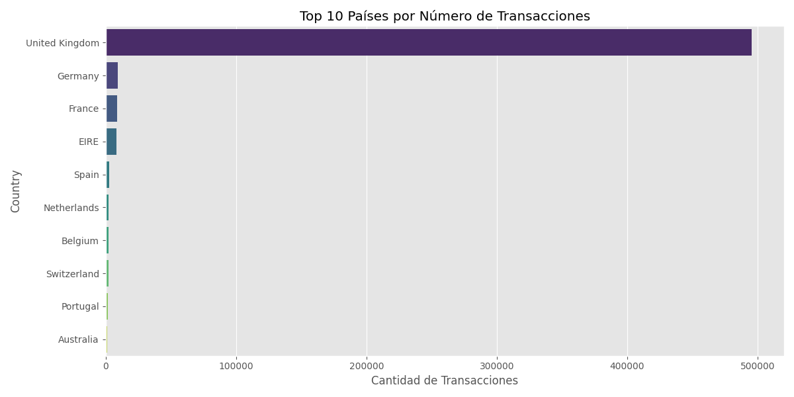
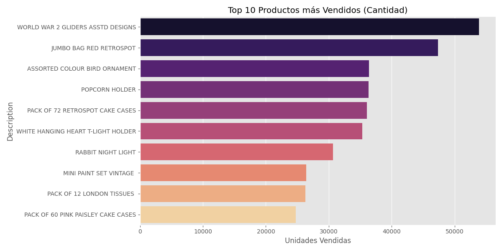

# Análisis Visual y Estadístico: Online Retail

## 1. Resumen Ejecutivo
- **Registros:** 541,909
- **Ingresos Totales:** 9,747,747.93
- **Periodo:** 2010-12-01 a 2011-12-09

## 2. Visualización Geográfica

*El Reino Unido domina el mercado, seguido por Alemania y Francia.*

## 3. Visualización de Productos

*Se observa una alta demanda de artículos de papelería y regalos decorativos.*

## 4. Top 10 Clientes (Ventas Totales)
| ID Cliente | Gasto Total |
|------------|-------------|
| 14646 | 279,489.02 |
| 18102 | 256,438.49 |
| 17450 | 187,482.17 |
| 14911 | 132,572.62 |
| 12415 | 123,725.45 |
| 14156 | 113,384.14 |
| 17511 | 88,125.38 |
| 16684 | 65,892.08 |
| 13694 | 62,653.10 |
| 15311 | 59,419.34 |

## 5. Estadísticas de Calidad
- **Clientes sin ID:** 135,080 (24.93%)
- **Países únicos:** 38
