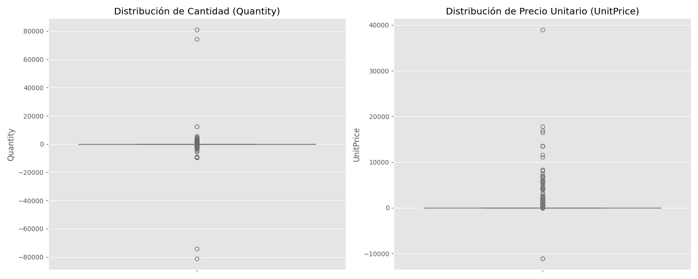
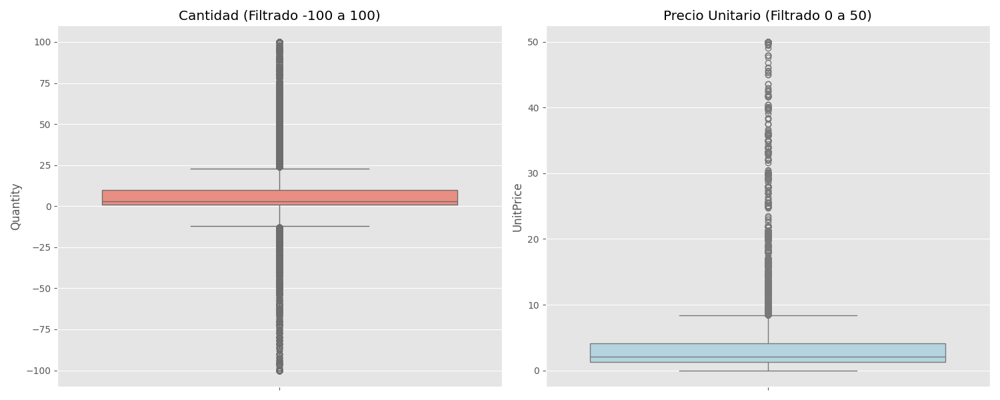
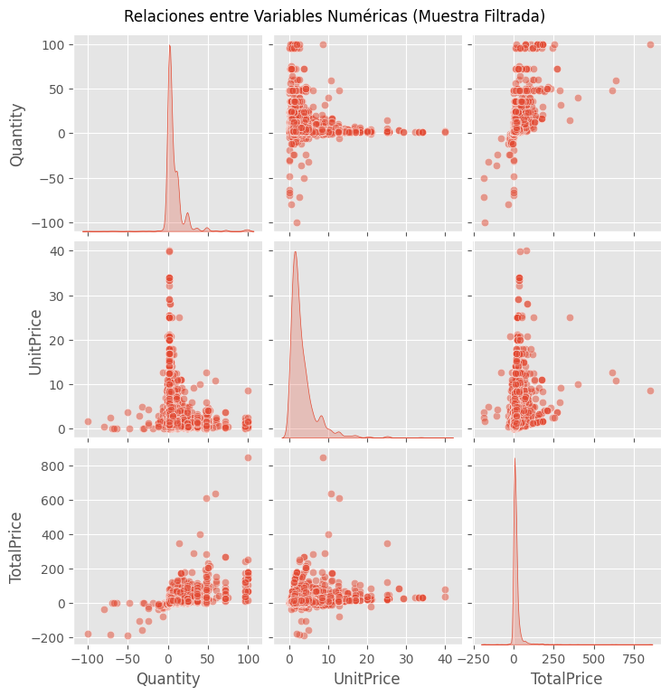
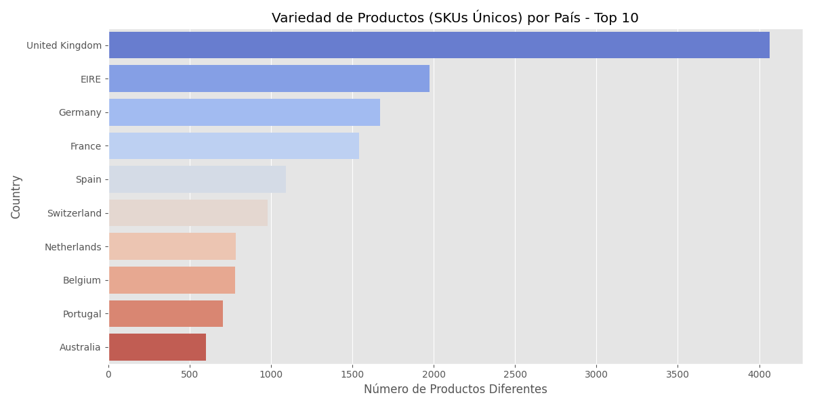
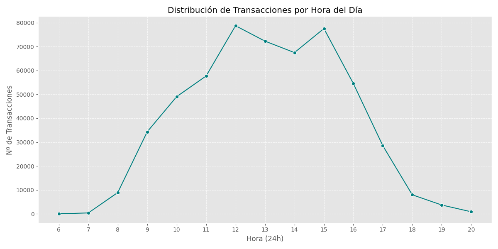
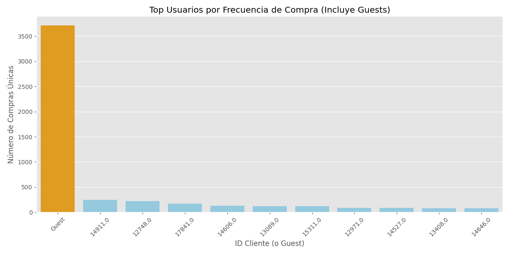

# Análisis Exploratorio de Datos (EDA) - Online Retail

## 1. Resumen de Operaciones
- **Registros procesados:** 541,909
- **Productos Únicos (SKUs):** 4,070
- **Ingresos Totales:** 9,747,747.93
- **Periodo:** 2010-12-01 a 2011-12-09

## 2. Definición de Variables y Naturaleza
| Columna | Tipo de Dato | Naturaleza | Descripción |
| :--- | :--- | :--- | :--- |
| **InvoiceNo** | object | Categórica | Variable del dataset |
| **StockCode** | object | Categórica | Variable del dataset |
| **Description** | object | Categórica | Variable del dataset |
| **Quantity** | int64 | Numérica (Discreta) | Variable del dataset |
| **InvoiceDate** | datetime64[us] | Temporal | Variable del dataset |
| **UnitPrice** | float64 | Numérica (Continua) | Variable del dataset |
| **CustomerID** | float64 | Categórica (ID) | Variable del dataset |
| **Country** | str | Categórica | Variable del dataset |
| **TotalPrice** | float64 | Numérica (Continua) | Cálculo: Quantity * UnitPrice |
| **Hour** | int32 | Numérica (Ordinal) | Hora extraída de InvoiceDate |

## 3. Métricas Estadísticas (Numéricas)
| Métrica | Quantity | UnitPrice | TotalPrice |
| :--- | :--- | :--- | :--- |
| **Media** | 9.5522 | 4.61 | 17.99 |
| **Mediana** | 3.00 | 2.08 | 9.75 |
| **Desv. Est.** | 218.08 | 96.76 | 378.81 |

## 4. Análisis de Outliers (Valores Atípicos)

## 5. Correlaciones y Relaciones

## 6. Calidad de Datos
- **Registros con cantidad negativa:** 10,624
- **Clientes sin ID:** 135,080 (24.93%)

## 7. Visualizaciones Clave
### 7.1 Variedad de Productos por País

### 7.2 Distribución Geográfica

### 7.3 Comportamiento Temporal

### 7.4 Análisis de Clientes (ID vs Guests)

## 8. Top 10 Clientes (Monetario)
| ID Cliente | Gasto Total |
|------------|-------------|
| 14646 | 279,489.02 |
| 18102 | 256,438.49 |
| 17450 | 187,482.17 |
| 14911 | 132,572.62 |
| 12415 | 123,725.45 |
| 14156 | 113,384.14 |
| 17511 | 88,125.38 |
| 16684 | 65,892.08 |
| 13694 | 62,653.10 |
| 15311 | 59,419.34 |

## 9. Conclusiones para K-Means
1. **Tratamiento de Outliers:** Limpiar extremos.
2. **Limpieza:** Filtrar negativos.
3. **Identificación:** Manejo de Guests.
