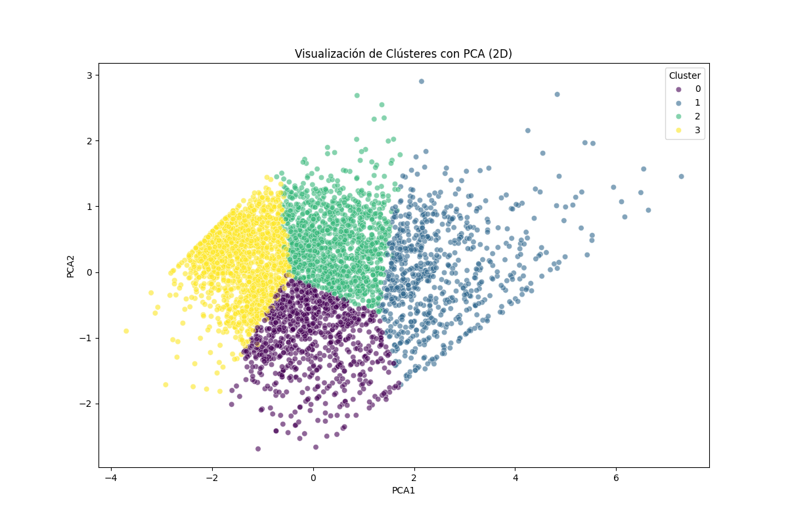
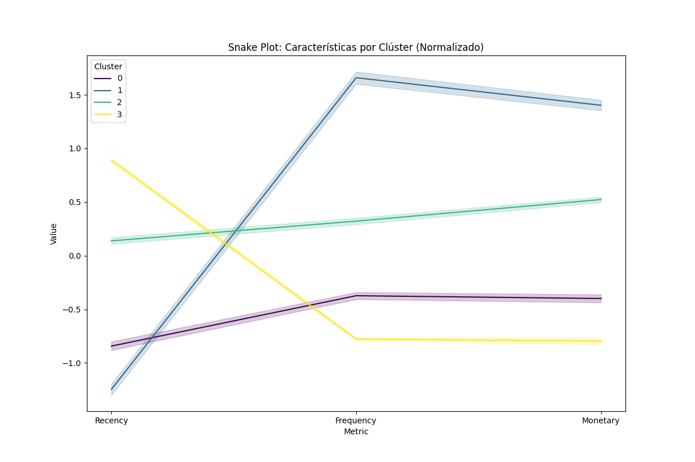
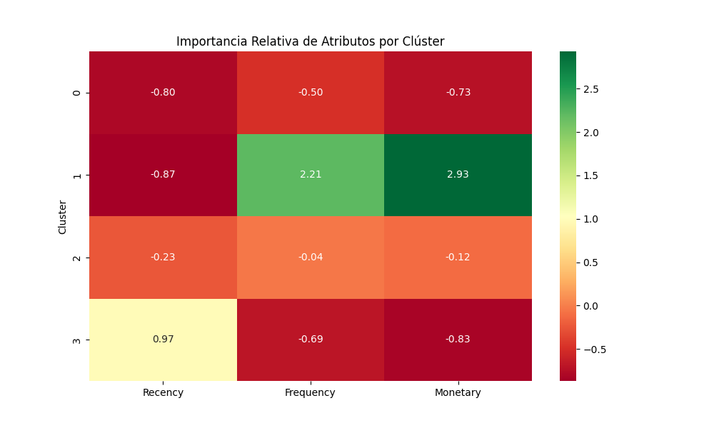

# Reporte de Segmentación de Clientes (Clustering RFM)

Este documento detalla los resultados del modelo avanzado de K-Means aplicado sobre la matriz **RFM** (Recency, Frequency, Monetary).

## 1. Metodología de Preparación
Para asegurar que el modelo K-Means sea efectivo, se realizaron los siguientes pasos:
- **Transformación Logarítmica:** Para reducir el sesgo de las variables (especialmente en Gasto y Frecuencia).
- **Escalado Estándar:** Normalización de los datos para que todas las variables tengan el mismo peso.
- **PCA (2 Componentes):** Reducción de dimensionalidad para visualizar los grupos en un plano 2D.

## 2. Validación del Modelo (Método del Codo)

*El gráfico confirma que **K=4** es el punto de inflexión óptimo donde se maximiza la cohesión de los grupos.*

## 3. Visualización de Segmentos (PCA)

*La separación de colores muestra fronteras claras entre los tipos de clientes, validando la efectividad del clustering.*

## 4. Perfiles de Clientes (Snake Plot)

*Este gráfico muestra cómo cada clúster se comporta en las 3 dimensiones (Recency, Frequency, Monetary).*

### Resumen de Segmentos e Impacto Financiero:
| Clúster | Segmento | % Ingresos | Ingreso Total | Gasto Medio | Estrategia |
| :--- | :--- | :--- | :--- | :--- | :--- |
| **1** | **Campeones** | **64.9%** | £5,781,175 | £8,074 | Fidelización VIP. |
| **2** | **En Riesgo** | **20.7%** | £1,847,902 | £1,802 | Campaña de reactivación urgente. |
| **0** | **Nuevos** | **8.9%** | £791,309 | £551 | Fomentar repetición. |
| **3** | **Perdidos** | **5.5%** | £490,463 | £343 | Automatización de bajo coste. |

*Nota: La concentración del 65% del ingreso en el Clúster 1 resalta la importancia crítica de retener a los clientes de alto valor.*

## 5. Importancia Relativa por Atributo

*El mapa de calor resalta que el **Clúster 1** domina masivamente en valor monetario comparado con el promedio de la población.*

## 6. Conclusiones Estratégicas
1. **Foco en Retención:** El Clúster 2 es crítico; son clientes valiosos que se están alejando. Reactivarlos será más barato que conseguir clientes nuevos.
2. **Optimización de Inventario:** Los Campeones compran 13 veces más seguido que los clientes perdidos; sus productos preferidos deben tener stock garantizado.
3. **Escalabilidad:** El modelo puede ejecutarse mensualmente para detectar cambios en el comportamiento de los clientes.
