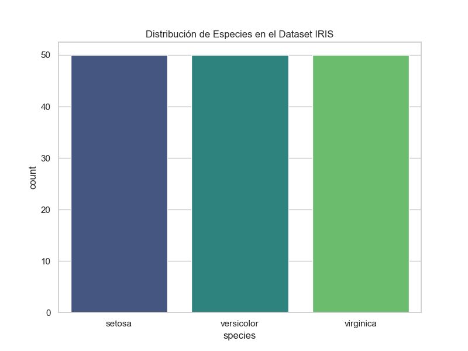
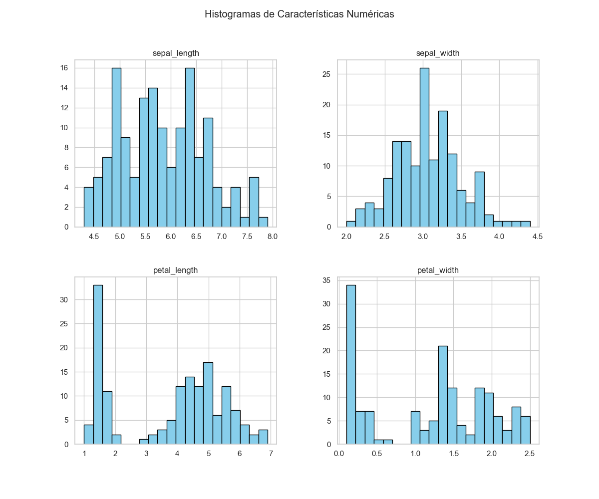
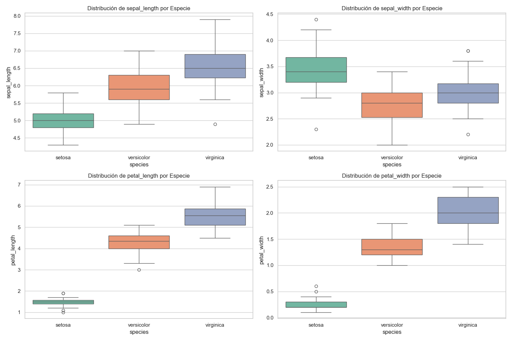
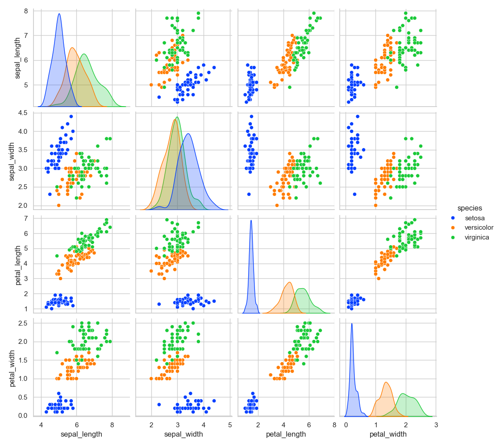
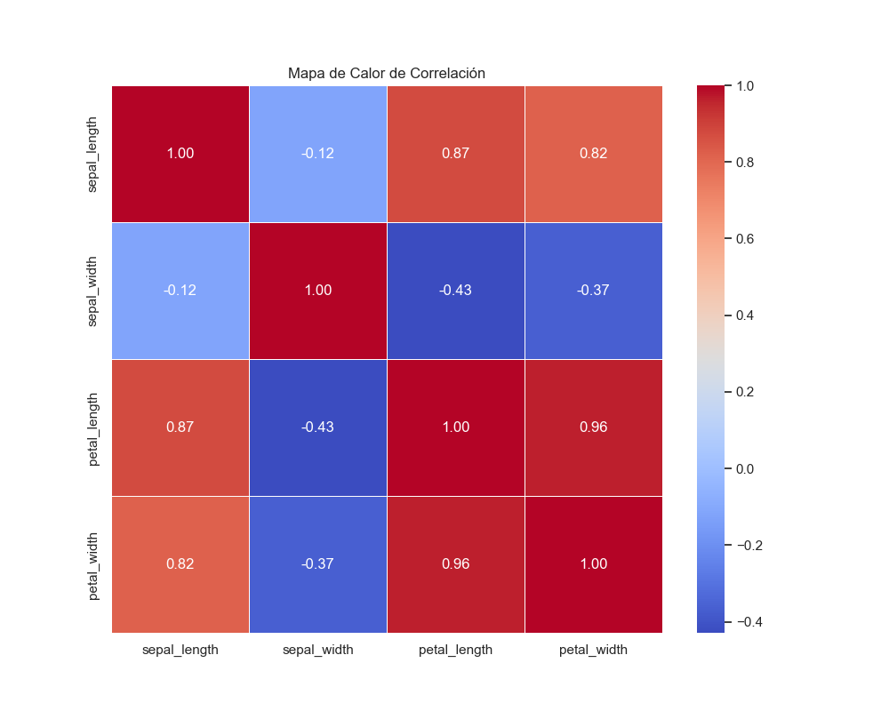

# Explicación del Análisis Exploratorio de Datos (EDA) - Dataset IRIS

Este documento detalla los pasos y hallazgos del análisis realizado en el script `eda_completo.py`.

## Descripción de las Variables

| Variable | Descripción | Tipo de Dato |
| :--- | :--- | :--- |
| **sepal_length** | Longitud del sépalo de la flor. | Numérico (cm) |
| **sepal_width** | Ancho del sépalo de la flor. | Numérico (cm) |
| **petal_length** | Longitud del pétalo de la flor. | Numérico (cm) |
| **petal_width** | Ancho del pétalo de la flor. | Numérico (cm) |
| **species** | Categoría de la especie (Setosa, Versicolor, Virginica). | Categórico |

## 1. Exploración Inicial y Estadísticas Básicas

En la primera etapa, se realiza una inspección cuantitativa del dataset:

- **Estructura del Dataset**: 150 registros y 5 columnas (4 numéricas y 1 categórica).
- **Tipos de Datos**: Todas las características de las flores son decimales (`float64`), y la especie es una cadena de texto.
- **Valores Nulos**: Se confirma que el dataset está limpio y no contiene valores perdidos.
- **Distribución de Clases**: Hay 50 muestras perfectamente balanceadas para cada especie (`setosa`, `versicolor`, `virginica`).

## 2. Análisis Univariado

Se analiza cada variable de forma aislada para entender su distribución:

- **Histogramas**: Nos permiten visualizar la frecuencia de rangos de valores. Se observa que:
  - `petal_length` y `petal_width` tienen distribuciones bimodales, lo que sugiere una clara separación de una de las especies (habitualmente `setosa`).
  - `sepal_length` y `sepal_width` siguen una distribución más cercana a la normal.

- **Countplot**: Confirma el balance perfecto entre las especies de flores.

## 3. Análisis Bivariado y Comparativo

Se estudia cómo varían las características en función de la especie:

- **Boxplots por Especie**: Son fundamentales para identificar:
  - **Mediana**: El valor central por cada tipo de flor.
  - **Dispersión**: El rango intercuartílico (la "caja").
  - **Outliers**: Puntos fuera de los bigotes (se observan algunos en `sepal_width` para la especie `virginica`).
  - **Hallazgo**: La especie `setosa` es drásticamente más pequeña en dimensiones de pétalos en comparación con las otras dos.

## 4. Análisis Multivariado y Correlaciones

Se examinan las relaciones entre múltiples variables simultáneamente:

- **Pairplot**: Muestra una matriz de gráficos de dispersión. Es la herramienta más potente para ver cómo las especies se agrupan en clusters.
  - Se puede ver que los pétalos son los mejores diferenciadores de especies.

- **Mapa de Calor (Heatmap) de Correlación**:
  - Hay una **correlación muy alta** entre `petal_length` and `petal_width`.
  - También hay una correlación positiva fuerte entre el largo del pétalo y el largo del sépalo.
  - El ancho del sépalo tiene una correlación débil o negativa con el resto de las variables.

## Conclusión

El EDA revela que el dataset IRIS es un problema de clasificación ideal, donde las dimensiones de los **pétalos** proporcionan información suficiente para distinguir entre las especies con alta precisión, especialmente para separar a `setosa` del resto.
