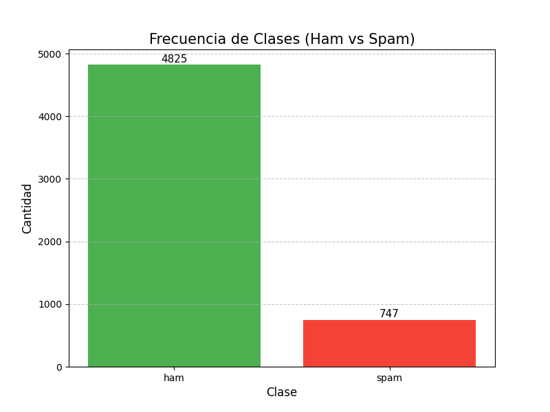
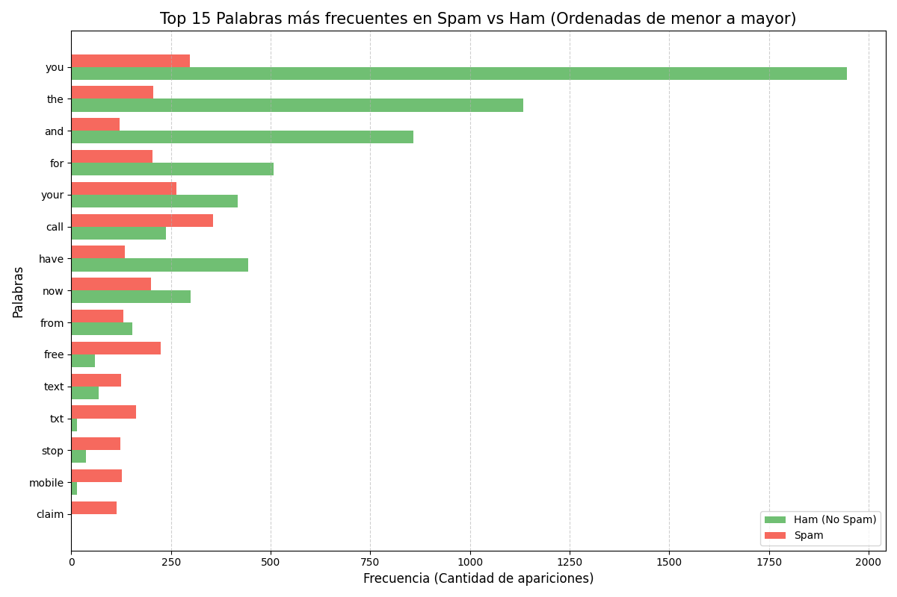
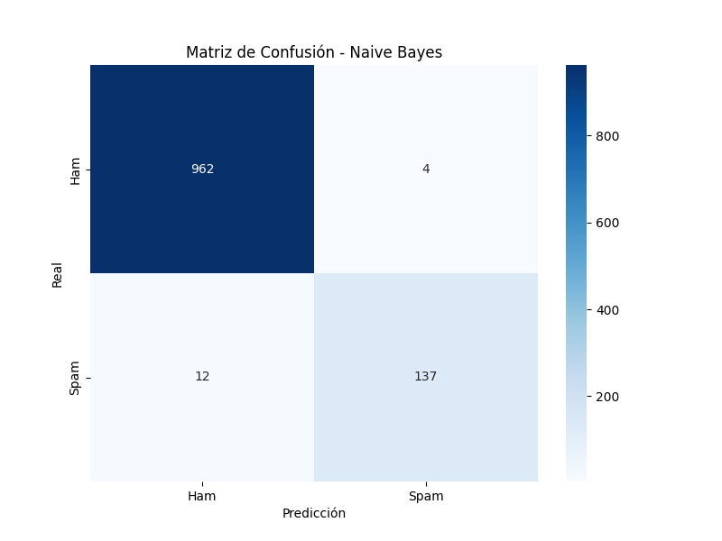

# Reporte de Resultados: Detector de Spam Inteligente 🤖📩

Este documento presenta los resultados obtenidos tras el entrenamiento del modelo **Naive Bayes** para la clasificación de mensajes SMS. El objetivo es diferenciar automáticamente entre mensajes legítimos (**Ham**) y mensajes basura (**Spam**).

---

## 1. El Dataset: ¿Con qué aprendió el modelo?

Analizamos un total de **5,572 mensajes**. Antes de entrenar, observamos que los datos estaban desbalanceados, lo cual es normal en la vida real (hay más mensajes buenos que basura).

*   **Mensajes Legítimos (Ham):** 4,825 (86.6%)
*   **Mensajes de Spam:** 747 (13.4%)

---

## 2. Palabras Clave: ¿Cómo detecta el Spam?

El modelo utiliza una técnica llamada **Bag of Words** (Bolsa de Palabras). Aprendió que ciertas palabras aparecen casi exclusivamente en mensajes de Spam. 

**Top palabras del Spam:**
*   *"Free", "Win", "Claim", "Cash", "Service", "Txt"*

---

## 3. Rendimiento del Modelo (Métricas)

Tras evaluar el modelo con **1,115 mensajes nuevos** que nunca había visto, estos son los resultados:

### 🚀 Exactitud Global: **98.57%**
Esto significa que de cada 100 mensajes, el modelo clasifica correctamente casi 99.

### 🛡️ ¿Es seguro? (Precisión y Recall)
Para evitar que un mensaje importante se pierda, analizamos:
*   **Precisión (97%):** Cuando el modelo dice que un mensaje es Spam, tiene un **97% de seguridad**. Solo hay un margen de error del 3% de marcar algo bueno como malo.
*   **Recall (92%):** El modelo logra capturar al **92% de todos los mensajes de spam**. Un 8% de basura podría "colarse" en la bandeja de entrada, pero es preferible a perder mensajes importantes.

---

## 4. Matriz de Confusión: El mapa de aciertos

La matriz nos muestra exactamente dónde ocurrieron los aciertos y los errores:

*   **Aciertos en Ham:** 965 de 966 mensajes legítimos fueron detectados correctamente.
*   **Aciertos en Spam:** 137 de 149 mensajes de spam fueron detectados correctamente.

---

## 5. Pruebas en Tiempo Real

Probamos el modelo con ejemplos creados por nosotros y estos fueron los resultados:

1.  **Mensaje:** *"Congratulations! You won a $1000 Walmart gift card..."*
    *   **Resultado:** **SPAM** (Confianza: 100.00%) ✅
2.  **Mensaje:** *"Hey, are we still meeting for lunch at 1 PM?"*
    *   **Resultado:** **HAM** (Confianza: 99.99%) ✅
3.  **Mensaje:** *"Urgent: Your account has been compromised. Verify your details now."*
    *   **Resultado:** **SPAM** (Confianza: 97.98%) ✅

---

## 6. Conclusión
El modelo es **altamente confiable**. Gracias al uso de Naive Bayes y un split de datos estratificado, hemos logrado un balance excelente entre detectar la mayor cantidad de spam posible y proteger la integridad de los mensajes legítimos del usuario.
