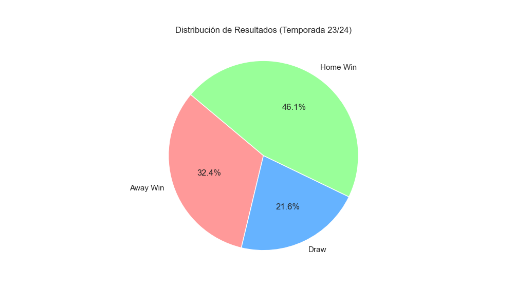
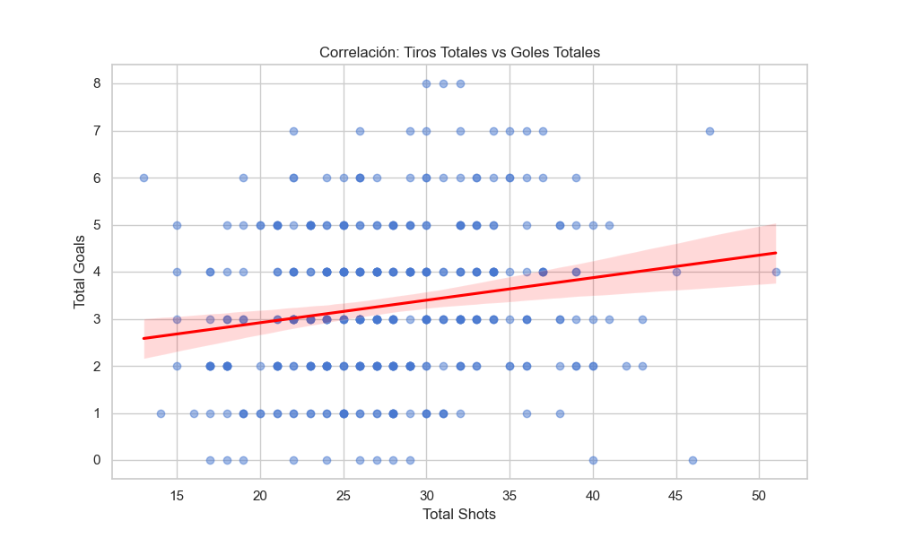
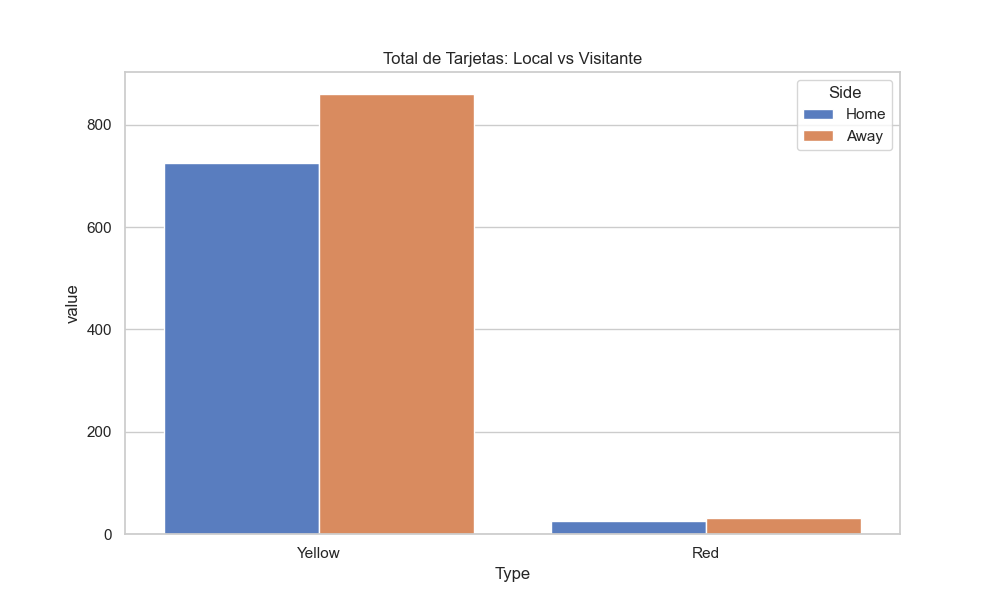
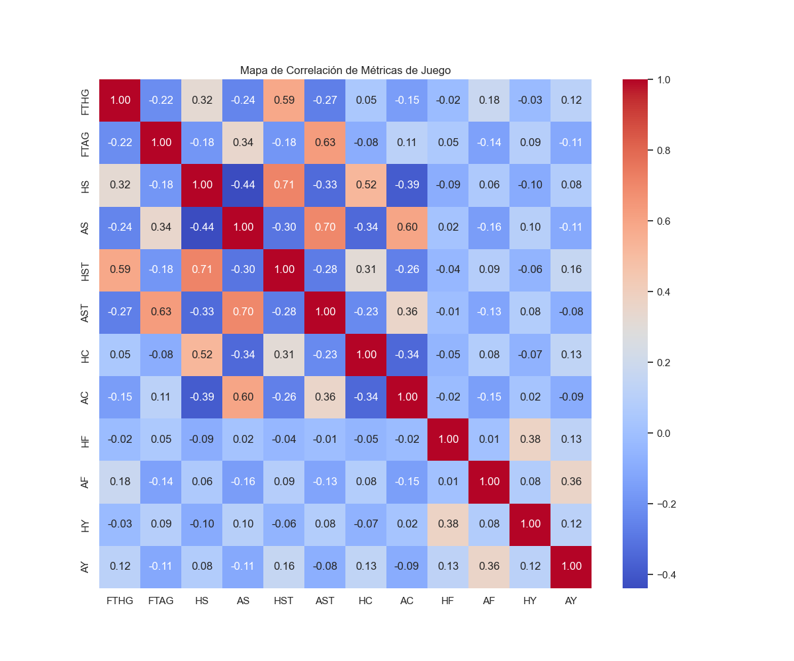

# Documentación de Datasets: Premier League

Este documento describe la estructura y contenido de los datos recopilados para el proyecto.

---

## 1. Datasets Históricos (Archivos CSV)
*Ejemplos: `pl_2425.csv`, `pl_2324.csv`, `pl_2223.csv`*

Estos archivos son los más completos para análisis estadístico y Machine Learning. Contienen ~120 columnas por cada partido.

### 📊 Variables de Juego (Métricas Clave)
| Sigla | Descripción | Importancia |
| :--- | :--- | :--- |
| **FTHG / FTAG** | Goles final del partido (Local / Visitante) | Objetivo principal del modelo. |
| **FTR** | Resultado final (H: Local, D: Empate, A: Visitante) | Variable objetivo para clasificación. |
| **HTHG / HTAG** | Goles al descanso | Útil para análisis de remontadas. |
| **HS / AS** | Remates totales (Home / Away) | Indica volumen ofensivo. |
| **HST / AST** | Remates a portería | Indica puntería y calidad del ataque. |
| **HC / AC** | Córners | Indica presión en campo contrario. |
| **HF / AF** | Faltas cometidas | Mide agresividad o control del juego. |
| **HY / AY** | Tarjetas Amarillas | Disciplina. |
| **HR / AR** | Tarjetas Rojas | Impacto crítico en el resultado. |

### 💰 Variables de Apuestas (Betting Odds)
Contienen las cuotas de diversas casas de apuestas. Son excelentes para calcular la "probabilidad implícita" del mercado.
- **B365H, B365D, B365A**: Cuotas de Bet365 para Local/Empate/Visitante.
- **PSH, PSD, PSA**: Cuotas de Pinnacle (suelen ser las más precisas).
- **MaxH, AvgH**: Cuotas máximas y promedio del mercado.

### ❓ Datos Faltantes (Análisis de Calidad)
- **Temporada 24/25**: Presenta valores `NaN` en algunas casas de apuestas (como Bwin o William Hill) para partidos recientes. 
- **Interpretación**: Los datos de juego están 100% completos para partidos jugados. Los nulos solo afectan a cuotas de apuestas específicas que no fueron recolectadas por la fuente original.

---

## 2. Dataset de API (JSON/CSV)
*Archivo: `api_sample_matches.csv`*

Este dataset proviene de la API de Football-Data.org. A diferencia de los CSV históricos, este contiene **el calendario completo** (pasado y futuro) y mucha información sobre la estructura de la liga.

### 📋 Categorías de Variables

#### A. Información de la Competición y Temporada
| Variable | Descripción |
| :--- | :--- |
| **season.startDate / endDate** | Inicio y fin de la temporada. |
| **season.currentMatchday** | Jornada actual de la Premier League. |
| **matchday** | Número de jornada (1-38) del partido específico. |
| **status** | Estado: `FINISHED` (jugado), `TIMED` (programado), `SCHEDULED` (sin hora fija). |

#### B. Identificación de Equipos (Metadata)
| Variable | Descripción |
| :--- | :--- |
| **homeTeam.name / awayTeam.name** | Nombres completos de los equipos. |
| **homeTeam.shortName / tla** | Nombre corto y abreviatura de 3 letras (ej: ARS, MCI). |
| **homeTeam.crest** | URL de la imagen del escudo del equipo. |

#### C. Resultados y Marcadores
| Variable | Descripción |
| :--- | :--- |
| **score.winner** | Indica quién ganó según la API (`HOME_TEAM`, `AWAY_TEAM`, `DRAW`). |
| **score.fullTime.home / away** | Goles finales. Aparecen como `NaN` si el partido no se ha jugado. |
| **score.halfTime.home / away** | Goles al descanso. |

### ❓ Datos Faltantes y Calidad
- **group / season.winner**: Estas columnas suelen estar vacías en la Premier League ya que es una liga regular (no tiene grupos) y el ganador solo se define al final.
- **score.xxx**: Los nulos en estas columnas son esperados para todos los partidos con `status` distinto a `FINISHED`.
- **Referees**: Lista de árbitros asignados (puede faltar en partidos lejanos).

---

## 3. Datos de Web Scraping (Firecrawl)
*Archivo: `data/raw/scraped_data/*.json`*

Datos extraídos directamente de sitios web (ej: BBC Sport) mediante Firecrawl.

### 📝 Estructura
- **markdown**: El contenido principal de la página convertido a texto limpio.
- **metadata**: Título, descripción y palabras clave de la página.

### 💡 Uso
Ideal para análisis de sentimiento, detección de lesiones o rumores de transferencias que afectan el rendimiento de los equipos.

---

## 📈 Análisis Visual y Hallazgos (Temporada 23/24)

Para entender los datos a profundidad, hemos generado visualizaciones basadas en una temporada completa.

### 🏠 1. Ventaja de Local (Home Advantage)

*   **Hallazgo**: Casi el **45-50%** de los partidos terminan en victoria local. Esto confirma que el factor campo es una variable crítica para cualquier modelo de predicción.

### 🎯 2. Relación Tiros vs Goles

*   **Hallazgo**: Existe una correlación lineal clara, pero con mucha dispersión. Algunos equipos necesitan 20 tiros para marcar, mientras que otros son extremadamente eficientes. La variable `HST` (Tiros a puerta) es mucho más predictiva que `HS` (Tiros totales).

### 🟨 3. Disciplina y Tarjetas

*   **Hallazgo**: Los equipos visitantes tienden a recibir ligeramente más tarjetas amarillas, posiblemente debido a una postura más defensiva o reactiva.

### 🌡️ 4. Mapa de Calor de Correlaciones

*   **Hallazgo Clave**: Los **Córners (`HC/AC`)** tienen una correlación positiva fuerte con los **Tiros (`HS/AS`)**, lo que indica presión ofensiva sostenida. Las faltas cometidas, curiosamente, no siempre correlacionan con la derrota, sino a veces con el control del ritmo del partido.

---

## ⚖️ Comparativa de Fuentes

| Característica | CSV Histórico | API (JSON/CSV) |
| :--- | :--- | :--- |
| **Uso Principal** | Entrenamiento de Modelos | Predicción de Futuro / Calendario |
| **Detalle Técnico** | Muy alto (Remates, corners, faltas) | Medio (Solo goles y tiempos) |
| **Apuestas** | Muchas fuentes comerciales | Muy limitado o básico |
| **Actualización** | Diaria/Semanal (manual) | Tiempo real (vía script) |

---

## 💡 Estrategia Sugerida
1.  **Entrenar** con los CSV históricos (tienen el detalle de remates necesario para un buen modelo).
2.  **Validar** con los partidos ya jugados de la API de esta temporada.
3.  **Predecir** usando la API para saber cuáles son los próximos partidos y qué equipos se enfrentan.
