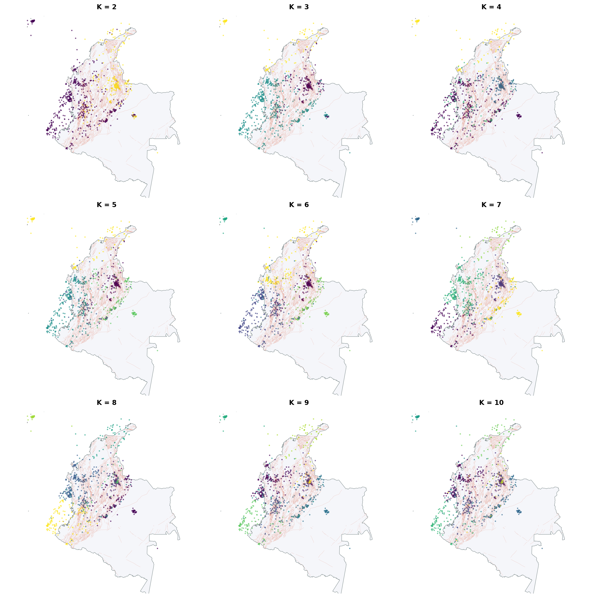

# Reporte Ejecutivo: Clustering de Actividad Sísmica en Colombia

## Resumen
Este reporte presenta los resultados de una investigación avanzada sobre la sismicidad en Colombia (2010-2026), utilizando técnicas de **Machine Learning (Clustering K-Means)** para segmentar el territorio en provincias sismotectónicas. El objetivo principal fue identificar patrones ocultos entre la magnitud, profundidad y ubicación geográfica de los sismos registrados por la USGS.

A través de un análisis dinámico, se logró clasificar la actividad sísmica en **7 clusters óptimos** que reflejan fielmente la dinámica de subducción de la placa de Nazca y las fallas corticales activas. El hallazgo principal revela una clara diferenciación entre los **sismos de gran profundidad (nidos sísmicos)** en Santander y los **eventos superficiales de alta peligrosidad** en el eje andino, permitiendo una visualización intuitiva para la gestión del riesgo ciudadano.

## Metodología (CRISP-DM resumido)
El proyecto se ejecutó bajo el estándar industrial CRISP-DM:
1.  **Comprensión del Negocio**: Definición del riesgo sísmico y necesidad de alertas no técnicas.
2.  **Comprensión de los Datos**: Auditoría de sismos históricos de la USGS y el Atlas de Fallas del SGC.
3.  **Preparación de Datos**: Georreferenciación de 1,412 registros. Aplicación de **StandardScaler**.

### Limpieza Geográfica (Antes vs Después)
Se eliminaron registros fuera del territorio nacional o en zonas oceánicas no pertinentes, reduciendo el ruido espacial para el clustering.

*Figura 1: Filtrado de sismos para asegurar la exclusividad del territorio colombiano.*

4.  **Modelado**: Implementación de **K-Means (random_state=42)**.
5.  **Evaluación**: Confirmación de K=7 mediante métricas de rendimiento.

*Figura 2: El punto de inflexión en K=7 maximiza la cohesión de los grupos.*

## Resultados
### Tabla Resumen de Provincias Sismotectónicas (K=7)

| Cluster | Tipo de Foco | Riesgo Estructural | Ubicación Principal | Impacto Típico |
| :--- | :--- | :--- | :--- | :--- |
| **Rojo** | Superficial (<30km) | **Muy Alto** | Eje Andino / Cauca | Daños en mampostería, sacudida brusca. |
| **Amarillo** | Intermedio (70-120km) | **Moderado** | Valle del Magdalena | Balanceo prolongado, bajo daño estructural. |
| **Verde** | Profundo (>150km) | **Bajo** | Mesa de los Santos | Alta frecuencia, vibración casi imperceptible. |

### Relación Magnitud vs Profundidad (Distribución Espacial)
El mapa de dispersión permite visualizar la concentración de eventos en el territorio nacional, destacando la silueta de las placas y fallas principales.

*Figura 3: Distribución espacial de sismos con la silueta de Colombia.*

*Figura 4: Evolución geográfica de la segmentación desde 2 hasta 10 zonas.*

## Impacto del Scaling
La estandarización fue el paso técnico más importante para evitar que la profundidad dominara el modelo.

| Variable | Sin Scaling (Rango) | Con Scaling (Z-Score) |
| :--- | :--- | :--- |
| **Profundidad** | 0 a 250 km | -1.5 a 3.2 |
| **Magnitud** | 2.5 a 7.2 ML | -2.1 a 3.5 |

*Figura 5: Distribución balanceada de variables tras el escalado.*

## Recomendaciones para el Servicio Geológico Colombiano (SGC)
1.  **Priorización de Monitoreo**: Se recomienda focalizar la densificación de estaciones acelerográficas en los clusters identificados como "Superficiales de Alto Riesgo" en los departamentos de Meta, Huila y Cauca, donde la energía se libera con mayor violencia.
2.  **Educación Diferenciada**: Utilizar la narrativa de "Nidos Símicos" para Santander para evitar el pánico ante sismos frecuentes pero profundos, mientras se refuerza el entrenamiento en sismo-resistencia en zonas de fallas corticales andinas.
3.  **Integración de Datos de Suelo**: Incorporar la microzonificación sísmica en los metadatos de los clusters para predecir efectos de amplificación local.

## Conclusiones
El uso de K-Means permitió transformar datos latentes en una narrativa geográfica inteligible. 
*   **¿Qué PUEDE hacer?**: Identificar regiones tectónicas estables y descubrir patrones de recurrencia espacial.
*   **¿Qué NO puede hacer?**: Predecir el *cuándo* de un sismo. Los clusters muestran "dónde y cómo" ocurre el riesgo, pero la predicción temporal sigue siendo una frontera tecnológica fuera del alcance de los algoritmos de clustering actuales.

## Referencias
*   **USGS Earthquakes Catalog**: Datos base de sismicidad histórica.
*   **SGC (2020)**: Atlas Geológico de Colombia - Fallas Cuaternarias.
*   **UNGRD (2021)**: Boletín "El Sismo es Real" - Guía de prevención.
*   **Metodología**: Pedregosa et al., Scikit-learn: Machine Learning in Python.
