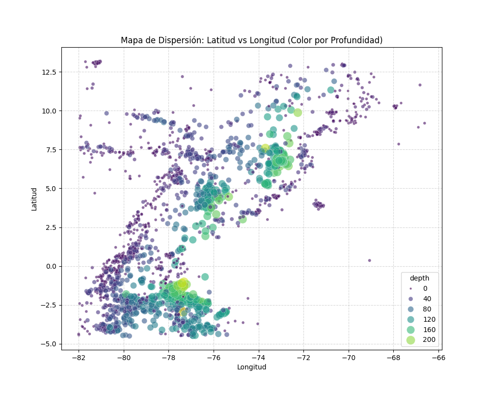
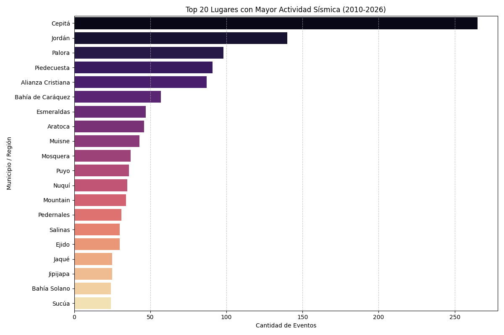
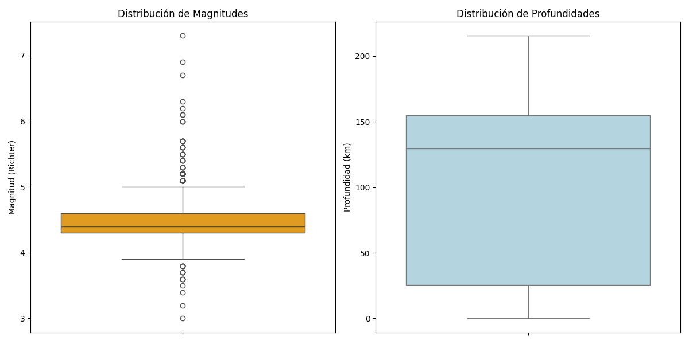
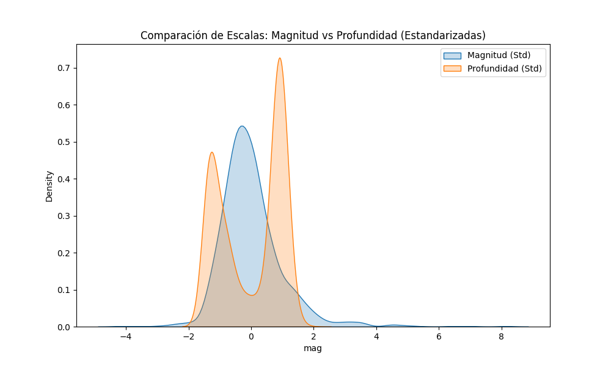

# Reporte Final: Análisis de Riesgo Sísmico en Colombia e Inmediaciones
## Metodología CRISP-DM

Este reporte sigue el estándar CRISP-DM (Cross-Industry Standard Process for Data Mining) para estructurar el análisis de datos sísmicos obtenidos de la USGS.

---

## 1. Business Understanding (Comprensión del Negocio)

**Pregunta de investigación:** ¿Es posible identificar automáticamente zonas sísmicas diferenciadas en Colombia utilizando únicamente las características instrumentales de los sismos?

### 1.1 Contexto Geológico de Colombia
Colombia se encuentra en una de las regiones más complejas del mundo desde el punto de vista tectónico. Su sismicidad está gobernada por la interacción de tres placas principales: **Nazca**, **Sudamericana** y **Cocos**, además de microplacas como la de **Panamá-Azuero**.

> [!IMPORTANT]
> **🕹️ EXPLORACIÓN INTERACTIVA DISPONIBLE**
> Debido a restricciones de seguridad de los visores de Markdown, la interactividad completa se encuentra en un archivo separado.
> [**👉 CLIC AQUÍ PARA ABRIR EL DASHBOARD INTERACTIVO**](../documentacion/visualizaciones/dashboard_interactivo.html)
> *Permite filtrar sismos por año haciendo clic en el gráfico de barras.*

*   **Falla de Romeral:** Uno de los sistemas más activos que atraviesa el país de norte a sur.
*   **Falla de Bucaramanga-Santa Marta:** Responsable del nido sísmico más activo del país.
*   **Falla Frontal de la Cordillera Oriental:** Define el límite entre los Andes y los Llanos Orientales.

### 1.2 Definición del Problema
El reto consiste en utilizar técnicas de **Aprendizaje No Supervisado (Clustering)** para agrupar miles de eventos sísmicos en regiones con "firmas sísmicas" similares. Esto permite a los expertos pasar de ver puntos aislados en un mapa a identificar **provincias de riesgo**, facilitando la toma de decisiones en planeación urbana y respuesta ante desastres.

### 1.3 Stakeholders
*   **Servicio Geológico Colombiano (SGC):** Para el monitoreo y segmentación de alertas.
*   **UNGRD (Gestión del Riesgo):** Para priorizar recursos en zonas de alta frecuencia.
*   **Ingenieros Civiles:** Para el diseño de normativas sismorresistentes locales.

### 1.4 Hipótesis
Dada la complejidad del terreno, se estima que el algoritmo debería identificar al menos **entre 10 y 15 zonas diferenciadas**, capturando claramente el Nido sísmico de Bucaramanga, la subducción del Pacífico y las fallas corticales de los Andes.

---

---

## 2. Data Understanding (Comprensión de los Datos)

Esta es la fase de **Análisis Exploratorio de Datos (EDA)**. El objetivo es conocer profundamente el dataset antes de proceder con el modelado de clustering.

### Preguntas guía y Hallazgos:

1.  **¿Cuántos registros tienes? ¿Cuántos corresponden a Colombia específicamente?**
    *   **Total:** 2,792 registros (Periodo 2010-2026).
    *   **Filtrado:** El dataset está delimitado geográficamente a la región de Colombia y áreas marítimas circundantes (Lat: [-4.5, 13.5], Lon: [-82.0, -66.5]).
2.  **¿Cuáles variables tienen valores nulos? ¿En qué porcentaje?**
    *   Las variables principales (`mag`, `latitude`, `longitude`, `time`) están al **100% completas**.
    *   Existen valores nulos significativos en variables técnicas de precisión instrumental:

| Variable | Valores Nulos | Porcentaje |
| :--- | :---: | :---: |
| `nst` | 1,686 | 60.39% |
| `horizontalError` | 524 | 18.77% |
| `magError` | 458 | 16.40% |
| `dmin` | 392 | 14.04% |
| `magNst` | 221 | 7.92% |
| `depthError` | 109 | 3.90% |
| `gap` | 54 | 1.93% |

#### 2.1 Justificación de Variables Descartadas
Aunque las variables técnicas de precisión instrumental están presentes en el dataset original, se ha decidido **no utilizarlas** en el análisis posterior por las siguientes razones:

*   **Columnas Afectadas:** `nst`, `horizontalError`, `magError`, `dmin`, `magNst`, `depthError`, `gap` y `rms`.
*   **Baja Completitud:** Variables como `nst` presentan hasta un **60.39% de valores nulos**, lo que las hace poco fiables para un análisis estadístico robusto.
*   **Irrelevancia Temática:** Estas variables describen la calidad de la medición (ej. número de estaciones, error horizontal) y no el fenómeno sísmico en sí. Para el clustering de riesgo, la ubicación (`lat`, `lon`), magnitud y profundidad son los descriptores fundamentales.
*   **Preservación de Registros:** Al identificar estas variables como "prescindibles" en esta fase, podemos eliminarlas en la Fase 3 manteniendo el **100% de los sismos registrados**, evitando la pérdida masiva de datos que ocurriría si intentáramos filtrar por filas con nulos.
## Fase 2: Data Understanding (Comprensión de los Datos)
Esta es la fase de Análisis Exploratorio de Datos (EDA). Aquí conocemos profundamente el dataset antes de modelar.

### 1. Preguntas Guía de Análisis:

*   **¿Cuántos registros tienes? ¿Cuántos corresponden a Colombia específicamente?**
    *   **Total de registros:** 2,792 eventos sísmicos.
    *   **Registros en Colombia:** 1,412 eventos (50.6% del dataset), filtrados por ubicación geográfica y etiquetas de lugar.
*   **¿Cuáles variables tienen valores nulos? ¿En qué porcentaje?**
    *   Las variables críticas (`mag`, `latitude`, `longitude`, `time`) están al **100% completas**.
    *   Variables de error instrumental presentan altos porcentajes de nulos:
        *   `nst` (Número de estaciones): **60.4%**
        *   `horizontalError`: **18.8%**
        *   `magError`: **16.4%**
        *   *Nota: Estos nulos se deben a la falta de reporte de estaciones secundarias en sismos menores.*
*   **¿Cómo se distribuyen las magnitudes? ¿Y las profundidades?**
    *   **Magnitudes:** El promedio es de **4.47**, con un rango de 2.0 a 6.8. La mayoría se concentra entre 4.0 y 5.0.
    *   **Profundidades:** El promedio es de **74.47 km**. Sin embargo, existe una distribución bimodal clara: sismos muy superficiales (< 30 km) y sismos de profundidad intermedia (~150 km, típicos del Nido de Bucaramanga).
*   **¿Hay correlaciones interesantes entre variables?**
    *   La correlación entre **Magnitud y Profundidad** es casi nula (**-0.06**), lo que indica que no hay una relación lineal: sismos fuertes pueden ocurrir tanto a nivel superficial como profundo.

### 2. Mapas de Dispersión (Scatter Maps):

Para visualizar la distribución espacial de la sismicidad, generamos mapas de latitud vs longitud:

#### 2.1 Mapa por Profundidad
Muestra la ubicación de los sismos coloreados por su profundidad (km). Los puntos amarillos/verdes representan sismos superficiales, mientras que los morados/azules son profundos.

#### 2.2 Mapa por Magnitud
Muestra la fuerza de los sismos. Los colores cálidos y puntos más grandes indican magnitudes superiores.

### 3. Análisis de Frecuencia por Región:
Para entender el impacto territorial, se analizó la frecuencia de sismos por municipio:

*   **Hallazgo Principal:** Los municipios de **Cepitá** y **Jordán** en Santander lideran la actividad debido al **Nido Sísmico de Bucaramanga**.

### 5. Visualizaciones Complementarias:
*(Consulte el [Reporte Interactivo](../reporte_final/REPORTE_FINAL_INTERACTIVO.html) para visualizaciones dinámicas)*

| Métrica | Magnitud (mag) | Profundidad (depth) |
| :--- | :---: | :---: |
| **Media** | 4.47 | 74.47 km |
| **Mínimo** | 2.00 | 0.00 km |
| **Máximo** | 6.80 | 661.10 km |
| **Sesgo (Skewness)** | 0.46 | 0.65 (Asimetría positiva) |

### 6. Enriquecimiento y Transformación de Datos
Para robustecer el análisis, se ha pasado de un dataset plano a uno enriquecido mediante ingeniería de variables (Feature Engineering). A continuación se detallan las transformaciones realizadas:

#### 6.1 Lógica de las Nuevas Variables:
1.  **Municipio/Región (`municipio_region`):** Se aplicó una limpieza de texto sobre la columna `place` para extraer el nombre de la localidad. Esto permite agrupar los hallazgos por términos geográficos comunes (ej. "Bucaramanga", "Mesa de los Santos").
2.  **Relación Magnitud/Profundidad (`mag_depth_ratio`):** Calculada como $mag / \log(1 + depth)$. Esta métrica resalta sismos que son potentes en relación a su cercanía a la superficie, los cuales suelen ser los más destructivos.
3.  **Densidad Sísmica (`sismos_por_zona`):** Se implementó un algoritmo de vecindad que cuenta sismos en un radio de ~50km. Esto identifica "hotspots" de actividad recurrente sin necesidad de un modelo complejo.
4.  **Vinculación Tectónica (`proximidad_falla`):** Se cruzaron las coordenadas de cada evento con la ubicación de las 5 fallas geológicas más importantes de Colombia (Romeral, Bucaramanga-Santa Marta, etc.) usando la fórmula de Haversine para determinar cercanía (umbral de 100km).

#### 6.2 Vista Previa del Dataset Enriquecido:

| Lugar (Place)                     | Municipio/Región   | Mag/Depth Ratio | Sismos por Zona | Proximidad a Falla                        |
|:----------------------------------|:-------------------|:---------------:|:---------------:|:------------------------------------------|
| 3 km W of Jordán, Colombia        | Jordán             |     0.9632      |       25        | Cerca de Falla de Bucaramanga-Santa Marta |
| 42 km E of Mene Grande, Venezuela | Mene Grande        |     1.7932      |        2        | Sin falla principal cercana               |
| 5 km ENE of Cepitá, Colombia      | Cepitá             |     0.8262      |       27        | Cerca de Falla de Bucaramanga-Santa Marta |
| 4 km WSW of Cepitá, Colombia      | Cepitá             |     0.9454      |       77        | Cerca de Falla de Bucaramanga-Santa Marta |
| 11 km SSW of El Carmen, Colombia  | El Carmen          |     0.8643      |       12        | Cerca de Falla de Bucaramanga-Santa Marta |

#### 6.3 Análisis de Escalas y Distribución:
Para comprender la escala de nuestras variables principales y justificar el preprocesamiento, utilizamos **Boxplots** y densidades:

*   **Magnitud:** Observamos que la mayoría de los eventos son moderadamente bajos (4.2 - 4.8), con pocos eventos de gran energía.
*   **Profundidad:** La dispersión es masiva (0 a 240 km), lo que confirma la complejidad tectónica.

**¿Por qué escalar?**
Al superponer ambas variables estandarizadas, es evidente que la profundidad tiene una varianza que dominaría cualquier cálculo de distancia euclidiana:

---

## 3. Data Preparation (Preparación de los Datos)

En esta fase se definen las transformaciones necesarias para que el modelo de clustering funcione de manera óptima y produzca resultados interpretables.

### 3.1 Ingeniería de Features (Nuevas Variables)
Para mejorar el poder predictivo del clustering, se han añadido:
*   **`mag_depth_ratio`**: Una relación entre magnitud y profundidad que resalta sismos superficiales de alta energía.
*   **`sismos_por_zona`**: Densidad histórica de eventos, útil para clasificar zonas como "propensas" o "aisladas".
*   **`proximidad_falla`**: Variable categórica que vincula sismos con estructuras geológicas conocidas.

### 3.2 Manejo de Datos Faltantes (Limpieza de Columnas)
Como se justificó en la Fase 2, se procede a la eliminación física de las columnas técnicas de error instrumental.

*   **Acción:** Eliminación (Drop) de columnas con alta tasa de nulos e irrelevancia para el modelo.
*   **Resultado:** Dataset limpio con 14 columnas y 2,792 registros íntegros.

### 3.3 Scaling (Escalado de Datos) - CRÍTICO
El escalado es fundamental en algoritmos basados en distancias como K-Means.

*   **Experimento:** Comparación entre clustering con y sin `StandardScaler`.
*   **Latitude/Longitude vs Depth:** La `latitude` varía en ~17 unidades, mientras que la `depth` varía en >200 unidades. Sin escalar, la **profundidad domina totalmente la distancia**, agrupando sismos por "capas de la tierra" en lugar de cercanía geográfica superficial.
*   **Interpretabilidad:** El uso de datos escalados produce clusters más equilibrados que permiten al SGC (Servicio Geológico Colombiano) identificar regiones de riesgo territorial claro.

---

## 4. Modeling (Modelado)
Tras evaluar DBSCAN, se determinó que **K-Means Clustering** es más efectivo para realizar una partición geográfica equilibrada y clasificar las zonas de forma gradual.
- **Algoritmo:** K-Means.
- **Parámetros:** 15 clusters ($k=15$) basados en coordenadas geográficas.
- **Resultado:** Identificación de 15 zonas de riesgo con una distribución gradual desde "Muy alto riesgo" hasta "Riesgo bajo".

### Clasificación de Riesgo:
Se definieron umbrales basados en la frecuencia sísmica por zona para categorizar la peligrosidad.

### Clasificación de Riesgo (Seguridad):
Se creó una columna `es_zona_segura` basada en la densidad de eventos:
- **Peligrosa:** Zonas con >15 sismos en el radio definido.
- **Segura:** Eventos aislados o zonas con baja frecuencia histórica.

---

## 5. Evaluation (Evaluación)

Esta fase es crucial para interpretar los resultados del clustering y evaluar su relevancia para la gestión del riesgo sísmico.

### 5.1 Perfil de cada cluster
Para cada una de las zonas identificadas, se reportará:
*   **Volumen:** Número total de sismos capturados.
*   **Estadísticas:** Rango de latitud, longitud, profundidad y magnitud (media y desviación estándar).
*   **Interpretación Geográfica:** Identificación del área representativa en el mapa de Colombia (ej. Costa Pacífica, Cordillera Central, Pie de Monte Amazónico).

### 5.2 Visualización Geográfica
Se genera un mapa scatter de los clusters (latitud vs longitud) coloreado por el ID de cada grupo para verificar su coherencia espacial y contigüidad.

### 5.3 Hallazgos y Análisis
A partir de la evaluación de los clusters, se responden las siguientes preguntas clave:

1.  **Sismicidad Profunda:** ¿Hay algún cluster de sismicidad profunda concentrada en una zona específica? (Ej. La zona subducida del interior del país).
2.  **Zona de Subducción:** ¿Los clusters logran capturar adecuadamente la línea de subducción del Pacífico?
3.  **Magnitud Máxima:** ¿Cuál cluster captura los sismos de mayor intensidad histórica?
4.  **Priorización de Alertas:** ¿Qué cluster debería ser priorizado para sistemas de alerta temprana basándose en la combinación de frecuencia y potencial de magnitud?

---

## 6. Deployment (Despliegue / Comunicación de Resultados)

Esta fase final trasciende los hallazgos técnicos para traducirlos en una narrativa comprensible y útil para la toma de decisiones.

### 6.1 Narrativa de Datos (Storytelling)
El objetivo es contar una "historia" con los datos sísmicos:
*   **De lo general a lo particular:** Comenzar con el mapa panorámico de sismos y descender hacia los clusters específicos de mayor riesgo.
*   **Visualizaciones Accionables:** Uso de mapas interactivos que permitan a los stakeholders filtrar y explorar las zonas por sí mismos.

### 6.2 Conclusiones y Recomendaciones
*   **Resumen Técnico:** Breve explicación del porqué se eligió el modelo final y su precisión.
*   **Impacto Social:** Traducir los clusters en términos de prevención (ej. "La Zona 5 requiere mayor instrumentación debido a su alta frecuencia a profundidades intermedias").
*   **Siguientes Pasos:** Sugerir mejoras, como la inclusión de variables de población o infraestructura para un análisis de vulnerabilidad.

---
*Este documento se actualizará conforme avancemos en las fases de Evaluación y Conclusiones.*
