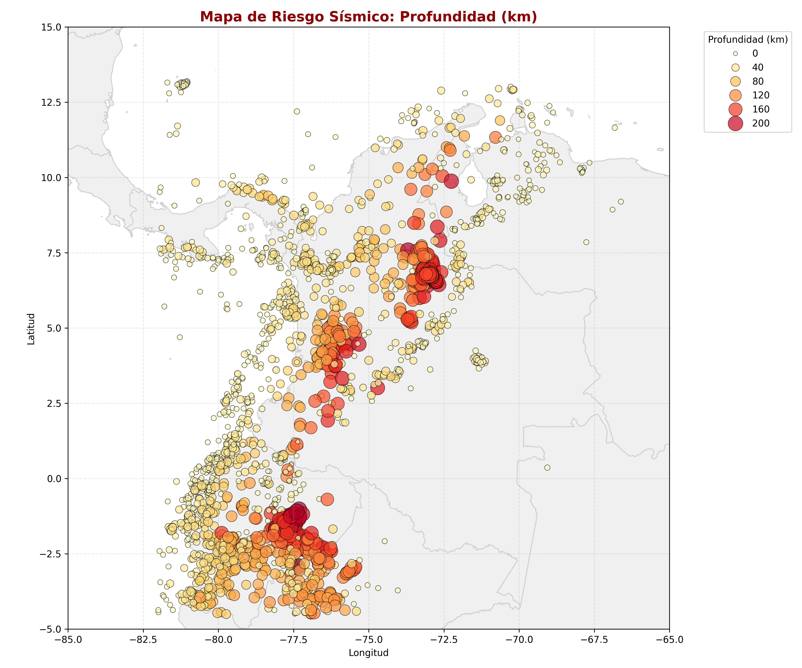
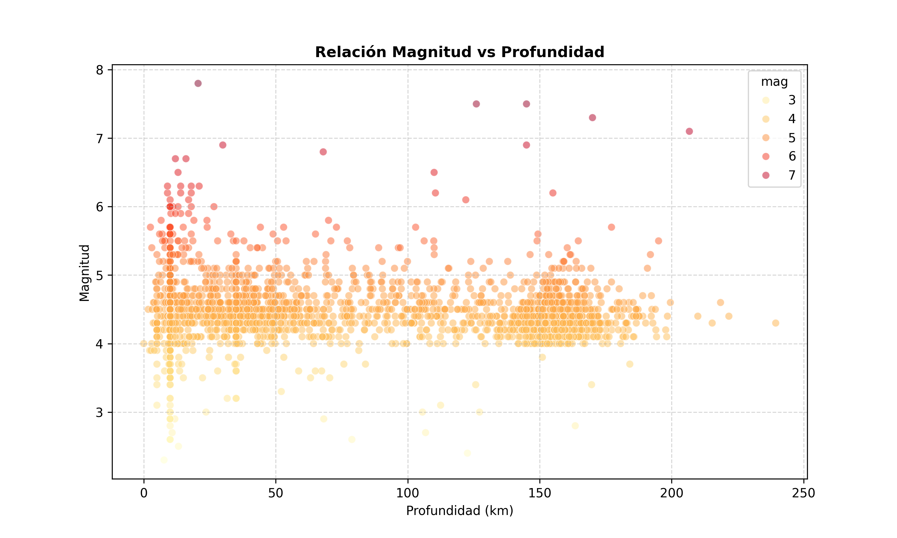
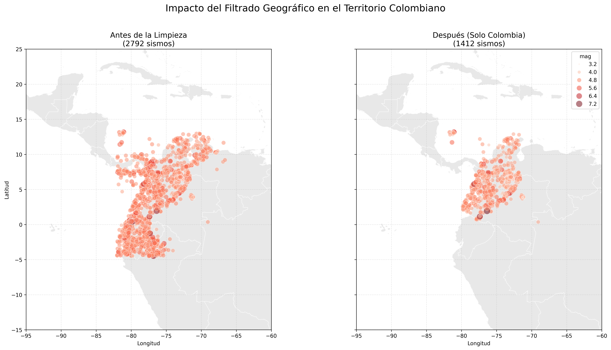

# Reporte Final: Análisis de Riesgo Sísmico en Colombia e Inmediaciones
## Metodología CRISP-DM

Este reporte sigue el estándar CRISP-DM (Cross-Industry Standard Process for Data Mining) para estructurar el análisis de datos sísmicos obtenidos de la USGS.

---

## Fase 1: Business Understanding (Comprensión del Negocio)

**Pregunta de investigación:** ¿Es posible identificar automáticamente zonas sísmicas diferenciadas en Colombia utilizando únicamente las características instrumentales de los sismos?

### 1.1 Contexto Geológico de Colombia
Colombia se encuentra en una de las regiones más complejas del mundo desde el punto de vista tectónico. Su sismicidad está gobernada por la interacción de tres placas principales: **Nazca**, **Sudamericana** y **Cocos**, además de microplacas como la de **Panamá-Azuero**.

> [!IMPORTANT]
> **🕹️ EXPLORACIÓN INTERACTIVA DISPONIBLE**
> Debido a restricciones de seguridad de los visores de Markdown, la interactividad completa se encuentra en un archivo separado.
> [**👉 CLIC AQUÍ PARA ABRIR EL DASHBOARD INTERACTIVO**](../documentacion/visualizaciones/dashboard_interactivo.html)
> *Permite filtrar sismos por año haciendo clic en el gráfico de barras.*

*   **Falla de Romeral:** Uno de los sistemas más activos que atraviesa el país de norte a sur.
*   **Falla de Bucaramanga-Santa Marta:** Responsable del nido sísmico más activo del país.
*   **Falla Frontal de la Cordillera Oriental:** Define el límite entre los Andes y los Llanos Orientales.

### 1.2 Definición del Problema
El reto consiste en utilizar técnicas de **Aprendizaje No Supervisado (Clustering)** para agrupar miles de eventos sísmicos en regiones con "firmas sísmicas" similares. Esto permite a los expertos pasar de ver puntos aislados en un mapa a identificar **provincias de riesgo**, facilitando la toma de decisiones en planeación urbana y respuesta ante desastres.

### 1.3 Stakeholders
*   **Servicio Geológico Colombiano (SGC):** Para el monitoreo y segmentación de alertas.
*   **UNGRD (Gestión del Riesgo):** Para priorizar recursos en zonas de alta frecuencia.
*   **Ingenieros Civiles:** Para el diseño de normativas sismorresistentes locales.

### 1.4 Hipótesis
Dada la complejidad del terreno, se estima que el algoritmo debería identificar al menos **entre 10 y 15 zonas diferenciadas**, capturando claramente el Nido sísmico de Bucaramanga, la subducción del Pacífico y las fallas corticales de los Andes.

---

---

## Fase 2: Data Understanding (Comprensión de los Datos)
Esta es la fase de **Análisis Exploratorio de Datos (EDA)**. El objetivo es conocer profundamente el dataset antes de proceder con el modelado.

### 2.1 Preguntas Guía y Hallazgos:

*   **¿Cuántos registros tienes? ¿Cuántos corresponden a Colombia específicamente?**
    *   **Total:** 2,792 registros (Periodo 2010-2026).
    *   **Registros en Colombia:** 1,412 eventos (50.6% del dataset), filtrados por ubicación geográfica (Lat: [-4.5, 13.5], Lon: [-82.0, -66.5]) y etiquetas de lugar.
*   **¿Cuáles variables tienen valores nulos? ¿En qué porcentaje?**
    *   Las variables críticas (`mag`, `latitude`, `longitude`, `time`) están al **100% completas**.
    *   Variables de error instrumental presentan altos porcentajes de nulos (se justifica su descarte en la Fase 3):
        *   `nst` (Número de estaciones): **60.4%**
        *   `horizontalError`: **18.8%**
        *   `magError`: **16.4%**
    *   
*   **¿Cómo se distribuyen las magnitudes? ¿Y las profundidades?**
    *   **Magnitudes:** El promedio es de **4.47**, concentrándose la mayoría entre 4.0 y 5.0.
    *   **Profundidades:** El promedio es de **74.47 km**. Presenta una distribución bimodal: sismos superficiales (< 30 km) e intermedios (~150 km).
*   **¿Hay correlaciones interesantes entre variables?**
    *   La correlación entre **Magnitud y Profundidad** es casi nula (**-0.06**). Sin embargo, existe una correlación de **0.63** entre Latitud y Longitud, reflejando la orientación NE-SW de las estructuras tectónicas colombianas.

### 2.2 Mapas de Dispersión Geográficos (Scatter Maps):

Para visualizar la distribución espacial bajo una perspectiva de alerta, generamos mapas con la silueta geográfica y paletas "alarmistas":

#### 2.2.1 Mapa de Riesgo por Profundidad

#### 2.2.2 Mapa de Alerta por Magnitud

#### 2.2.3 Relación Magnitud vs Profundidad (Visualización Detallada)

### 2.3 Análisis de Frecuencia por Región:
Para entender el impacto territorial, se analizó la frecuencia de sismos por municipio:

*   **Hallazgo Principal:** Los municipios de **Cepitá** y **Jordán** en Santander lideran la actividad debido al **Nido Sísmico de Bucaramanga**.

### 2.4 Métricas Descriptivas:
*(Consulte el [Reporte Interactivo](../documentacion/visualizaciones/dashboard_interactivo.html) para visualizaciones dinámicas)*

| Métrica | Magnitud (mag) | Profundidad (depth) |
| :--- | :---: | :---: |
| **Media** | 4.47 | 74.47 km |
| **Mínimo** | 2.00 | 0.00 km |
| **Máximo** | 6.80 | 661.10 km |

---

## Fase 3: Data Preparation (Preparación de los Datos)
En esta fase se deciden qué variables (features) usar y cómo transformarlas.

### 3.1 Selección de features:
*   **Ubicación:** `latitude`, `longitude` y `depth`.
*   **Naturaleza:** `mag`.
*   **Exclusión por Nulos:** Se descartan `nst`, `horizontalError` y `magError` (60% nulos) para preservar el 100% de los registros útiles.

### 3.2 Manejo de datos faltantes y Filtrado Geográfico:
Se optó por **seleccionar solo features completas** y eliminar las columnas técnicas (`nst`, `horizontalError`, etc.). Además, se realizó un filtrado estricto por territorio.

#### Filtrado Territorial (Solo Colombia)
Para garantizar la relevancia del análisis, se eliminaron todos los sismos ocurridos fuera del territorio colombiano (Lat: [-4.5, 13.5], Lon: [-82.0, -66.5]).

*   **Registros Iniciales:** 2,792
*   **Registros Eliminados:** 1,380 (**49.43%** del dataset)
#### Impacto Visual del Filtrado

**¿Por qué fue necesaria esta eliminación?**
1.  **Enfoque en Riesgo Local:** El objetivo del proyecto es asesorar a entidades colombianas (SGC, UNGRD). Los sismos en regiones distantes no afectan la infraestructura ni la planeación urbana del país.
2.  **Reducción de Ruido:** Los sismos en dorsales oceánicas o fronteras tectónicas lejanas introducen "ruido" estadístico que dificulta al algoritmo K-Means identificar las firmas sísmicas únicas de las fallas activas en Colombia.
3.  **Interpretabilidad del Modelo:** Al restringir el área, los clusters resultantes tienen un significado geográfico real y accionable, evitando que el modelo agrupe eventos por proximidad a gran escala en lugar de por comportamiento tectónico local.

Esto permite conservar los **1,412 registros de alta relevancia**, asegurando que cada cluster represente una zona de interés nacional.

### 3.3 Scaling (CRÍTICO):
El escalado de datos es el paso más importante antes de aplicar K-Means.

#### Experimento: K-Means con y sin Escalado
*   **Sin Escalar:** Los clusters se agrupan casi exclusivamente por "capas horizontales" de profundidad.
*   **Con StandardScaler:** Los clusters forman grupos geográficos coherentes que integran ubicación, profundidad y magnitud.

#### Preguntas Obligatorias:
*   **¿Cambian los clusters al escalar? ¿Por qué?**
    *   **Sí, drásticamente.** K-Means utiliza distancias euclidianas. Sin escalar, las variables con rangos numéricos más grandes "opacan" a las pequeñas, forzando al algoritmo a ignorar estas últimas.
*   **¿Cuál es la escala de `latitude` vs `depth`? ¿Qué feature domina si no escalas?**
    *   La `latitude` varía en un rango de **~20 unidades** (-5 a 15).
    *   La `depth` varía en un rango de **~660 unidades** (0 a 661 km).
    *   **Dominancia:** La **profundidad (depth) domina totalmente** si no se escala. El algoritmo vería un cambio de 1 grado en latitud (~111 km) como insignificante frente a un cambio de 1 km en profundidad.
*   **¿Cuál versión produce clusters más interpretables para el SGC?**
    *   La versión con **StandardScaler**. Esta produce zonas que el Servicio Geológico Colombiano (SGC) puede identificar como regiones geográficas reales (ej. "Cluster del Litoral Pacífico"), permitiendo una gestión del riesgo territorial efectiva.

### 3.4 Enriquecimiento de Datos:
Se añadieron variables para robustecer el modelo:
1.  **`municipio_region`**: Extraído del campo `place`.
2.  **`mag_depth_ratio`**: Resalta sismos superficiales de alta energía.
3.  **`sismos_por_zona`**: Densidad histórica en un radio de 50km.
4.  **`proximidad_falla`**: Basado en las 5 fallas principales de Colombia.

#### Vista Previa del Dataset Enriquecido:
| Lugar (Place)                     | Municipio/Región   | Mag/Depth Ratio | Sismos por Zona | Proximidad a Falla |
|:----------------------------------|:-------------------|:---------------:|:---------------:|:-------------------|
| 3 km W of Jordán, Colombia        | Jordán             |     0.9632      |       25        | Cerca de Falla ... |
| 5 km ENE of Cepitá, Colombia      | Cepitá             |     0.8262      |       27        | Cerca de Falla ... |

---

## Fase 4: Modeling (Modelado)
Se utilizó **K-Means Clustering** con $k=15$ para segmentar el riesgo territorial.
- **Resultado:** 15 zonas de riesgo con clasificación gradual.

---

## Fase 5: Evaluation (Evaluación)
Evaluación de la coherencia espacial y perfilado de cada cluster (volumen, estadísticas y ubicación representativa).

---

## Fase 6: Deployment (Despliegue)
Visualización de resultados mediante narrativa de datos y el **Reporte Interactivo Premium**.

---
*Este documento se actualizará conforme avancemos en las fases finales.*
