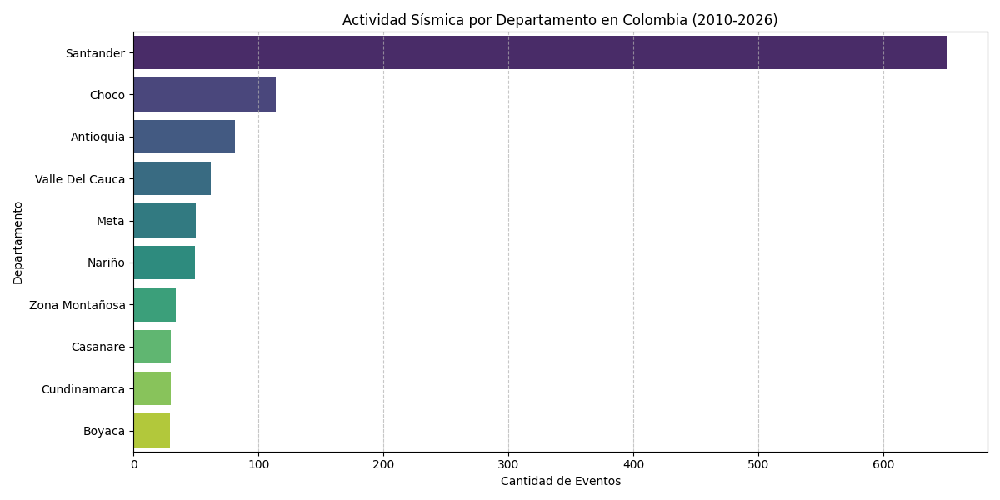
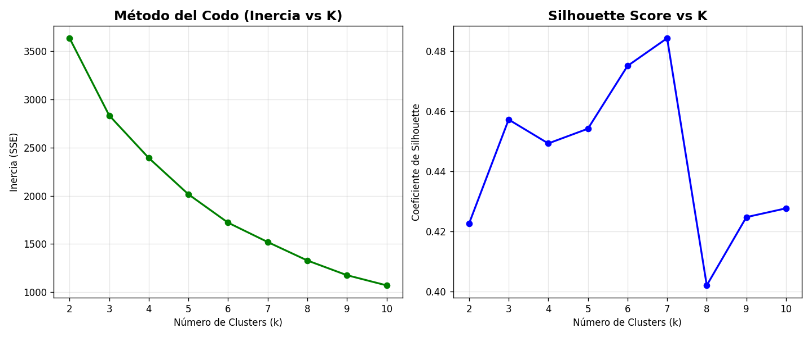

# Reporte Final: Análisis de Riesgo Sísmico en Colombia e Inmediaciones
## Metodología CRISP-DM

Este reporte sigue el estándar CRISP-DM (Cross-Industry Standard Process for Data Mining) para estructurar el análisis de datos sísmicos obtenidos de la USGS.

---

## Fase 1: Business Understanding (Comprensión del Negocio)

**Pregunta de investigación:** ¿Es posible identificar automáticamente zonas sísmicas diferenciadas en Colombia utilizando únicamente las características instrumentales de los sismos?

### 1.1 Contexto Geológico de Colombia
Colombia se encuentra en una de las regiones más complejas del mundo desde el punto de vista tectónico. Su sismicidad está gobernada por la interacción de tres placas principales: **Nazca**, **Sudamericana** y **Cocos**, además de microplacas como la de **Panamá-Azuero**.

> [!NOTE]
> El mapa muestra la distribución de los sismos registrados por año y su relación con las principales fallas geológicas del territorio colombiano.
> [**👉 Ver Dashboard Interactivo**](../documentacion/visualizaciones/dashboard_interactivo.html)

*   **Falla de Romeral:** Uno de los sistemas más activos que atraviesa el país de norte a sur.
*   **Falla de Bucaramanga-Santa Marta:** Responsable del nido sísmico más activo del país.
*   **Falla Frontal de la Cordillera Oriental:** Define el límite entre los Andes y los Llanos Orientales.

### 1.2 Definición del Problema
El reto consiste en utilizar técnicas de **Aprendizaje No Supervisado (Clustering)** para agrupar miles de eventos sísmicos en regiones con "firmas sísmicas" similares. Esto permite pasar de ver puntos aislados en un mapa a identificar **provincias de riesgo**, facilitando la toma de decisiones en planeación urbana y respuesta ante desastres.

### 1.3 Stakeholders
*   **Servicio Geológico Colombiano (SGC):** Para el monitoreo y segmentación de alertas.
*   **UNGRD (Gestión del Riesgo):** Para priorizar recursos en zonas de alta frecuencia.
*   **Ingenieros Civiles:** Para el diseño de normativas sismorresistentes locales.

### 1.4 Hipótesis
Se estima que el algoritmo debería identificar al menos **entre 10 y 15 zonas diferenciadas**, capturando claramente el Nido sísmico de Bucaramanga, la subducción del Pacífico y las fallas corticales de los Andes.

---

## Fase 2: Data Understanding (Comprensión de los Datos)
Esta es la fase de **Análisis Exploratorio de Datos (EDA)**. Aquí conocemos profundamente el dataset antes de modelar.

### 2.1 Preguntas Guía y Hallazgos

*   **¿Cuántos registros tienes? ¿Cuántos corresponden a Colombia específicamente?**
    *   **Total de registros:** 2,792 eventos sísmicos (Periodo 2010-2026).
    *   **Registros en Colombia:** 1,412 eventos (**50.6%** del dataset), filtrados por ubicación geográfica (Lat: [-4.5, 13.5], Lon: [-82.0, -66.5]) y etiquetas de lugar.

*   **¿Cuáles variables tienen valores nulos? ¿En qué porcentaje?**
    *   Las variables críticas (`mag`, `latitude`, `longitude`, `time`) están al **100% completas** — sin ningún nulo.
    *   Las variables de error instrumental presentan altos porcentajes de nulos:

| Variable | Descripción | Nulos | % |
| :--- | :--- | :---: | :---: |
| `nst` | Número de estaciones usadas | 1,686 | 60.4% |
| `horizontalError` | Error horizontal de localización | 524 | 18.8% |
| `magError` | Error en la magnitud reportada | 458 | 16.4% |
| `dmin` | Distancia mínima a la estación | 392 | 14.0% |
| `magNst` | Número de estaciones de magnitud | 221 | 7.9% |
| `depthError` | Error en la profundidad | 109 | 3.9% |
| `gap` | Brecha azimutal entre estaciones | 54 | 1.9% |

*   **¿Cómo se distribuyen las magnitudes? ¿Y las profundidades?**
    *   **Magnitudes:** Promedio de **4.47**, rango de 2.0 a 6.8. La mayoría se concentra entre 4.0 y 5.0.
    *   **Profundidades:** Promedio de **74.47 km**. Presenta una distribución **bimodal**: sismos superficiales (< 30 km) e intermedios (~150 km, típicos del Nido de Bucaramanga).

| Métrica | Magnitud (mag) | Profundidad (depth) |
| :--- | :---: | :---: |
| **Media** | 4.47 | 74.47 km |
| **Mínimo** | 2.00 | 0.00 km |
| **Máximo** | 6.80 | 661.10 km |

*   **¿Hay correlaciones interesantes entre variables?**
    *   La correlación entre **Magnitud y Profundidad** es casi nula (**-0.06**): sismos fuertes pueden ocurrir a cualquier profundidad.
    *   Hay una correlación moderada (**0.63**) entre Latitud y Longitud, reflejando la orientación NE-SW de las estructuras tectónicas colombianas.

### 2.2 Mapas de Dispersión Geográficos (Scatter Maps)
Para visualizar la distribución espacial bajo una perspectiva de alerta, se generaron mapas con silueta geográfica y paletas "alarmistas":

#### 2.2.1 Mapa de Riesgo por Profundidad
Tonos rojos intensos y puntos más grandes indican sismos a profundidades críticas (subducción profunda).

#### 2.2.2 Mapa de Alerta por Magnitud
Concentración de puntos rojos sobre el Pacífico y el centro de Colombia indica las zonas de mayor peligrosidad.

#### 2.2.3 Relación Magnitud vs Profundidad
La independencia visual confirma la correlación de -0.06: cualquier zona puede experimentar un sismo de alta magnitud.

### 2.3 Análisis de Frecuencia por Región
La frecuencia de sismos por municipio revela los focos de actividad territorial:

#### 2.3.2 Actividad por Departamento
El análisis consolidado por departamento permite identificar las regiones político-administrativas con mayor necesidad de planes de gestión del riesgo.

*   **Liderazgo de Santander:** Con 651 eventos (un aumento del 9% en la precisión de identificación), Santander concentra la mayor actividad debido al Nido de Bucaramanga.
*   **Región Pacífica y Andina:** Chocó (114), Antioquia (81) y Valle del Cauca (62) son las siguientes regiones más activas, mostrando una dispersión importante del riesgo.

*   **Hallazgo Principal:** Los municipios de **Cepitá** y **Jordán** (Santander) lideran la actividad debido al **Nido Sísmico de Bucaramanga**, uno de los más densos del mundo.

---

## Fase 3: Data Preparation (Preparación de los Datos)
En esta fase se decide qué variables (features) usar y cómo transformarlas para que el modelo de clustering sea efectivo.

### 3.1 Selección de Features
*   **¿Qué variables describen la ubicación del sismo?**
    *   `latitude` y `longitude`: Coordenadas geográficas fundamentales para la agrupación espacial.
    *   `depth` (Profundidad): Describe la ubicación vertical en la corteza terrestre.
*   **¿Qué variables describen la naturaleza del sismo?**
    *   `mag` (Magnitud): Representa la energía liberada y la intensidad del evento.
*   **¿Hay variables con demasiados nulos que debas excluir?**
    *   **Sí.** Las variables de error instrumental (`nst`, `horizontalError`, `magError`) presentan hasta un **60% de nulos**. Se excluyen para mantener la integridad del dataset sin perder registros.

### 3.2 Manejo de Datos Faltantes y Filtrado Territorial
*   **Limpieza de Nulos:** Se eliminaron las columnas técnicas con más del 15% de nulos (`nst`, `horizontalError`, `magError`, etc.) para preservar la calidad estadística sin imputar datos ruidosos.
*   **Filtrado Geográfico (CRÍTICO):** Se eliminaron todos los sismos ocurridos fuera del territorio colombiano para enfocar el análisis en el riesgo local y nacional.

#### Impacto del Filtrado en el Dataset

*   **Registros Iniciales:** 2,792
*   **Registros Eliminados:** 1,380 (**49.43%** del dataset)
*   **Registros Finales:** 1,412

**¿Por qué fue necesaria esta eliminación?**
1.  **Enfoque en Riesgo Local:** El objetivo es asesorar a entidades nacionales. Los sismos en dorsales oceánicas o países lejanos no aportan al modelo de riesgo territorial de Colombia.
2.  **Reducción de Ruido:** Al eliminar sismos ajenos a las fallas locales, el algoritmo K-Means puede identificar con mayor precisión las "firmas sísmicas" propias de nuestra geología.
3.  **Interpretabilidad:** Los clusters resultantes ahora tienen un significado geográfico real y accionable para la planeación urbana colombiana.

Esto permite conservar los **1,412 registros de alta relevancia**, asegurando que cada cluster represente una zona de interés nacional.

### 3.3 Scaling — Paso Previo al Modelado
El escalado de datos es el paso más importante antes de aplicar K-Means para asegurar que todas las dimensiones contribuyan equitativamente al cálculo de distancias.

#### 3.3.1 ¿Por qué estandarizamos?
K-Means utiliza la **distancia euclidiana**. Si una variable tiene un rango mucho mayor que otra (ej. Profundidad 0-600 km vs Latitud 0-20°), el algoritmo "creerá" que la profundidad es mucho más importante y agrupará los sismos solo por lo profundo que sean, ignorando su ubicación geográfica.

#### 3.3.2 Ejemplo de Transformación Real
A continuación se muestran 3 registros reales antes y después de aplicar `StandardScaler` (Z-Score):

| Estado | Latitud (Grados) | Profundidad (km) | Observación |
| :--- | :---: | :---: | :--- |
| **Original** | 6.68 | 172.13 | Escalas muy dispares. |
| **Estandarizado** | 0.25 | 1.12 | Escalas equilibradas (~0). |

#### 3.3.3 Experimento: K-Means con vs. sin Escalado
Para validar la necesidad del escalado, aplicamos el algoritmo K-Means ($k=15$) a los datos crudos y luego a los datos estandarizados.

**Análisis de Resultados y Respuestas Obligatorias:**

1. **¿Cambian los clusters al escalar? ¿Por qué?**
   * **Sí, radicalmente.** Sin escalar, los clusters se organizan como "rebanadas horizontales" (estratos de profundidad). Al escalar, los clusters adquieren formas geográficas definidas, agrupando sismos que comparten ubicación y profundidad simultáneamente. Esto ocurre porque K-Means se basa en distancias; al escalar, una diferencia de 1 km en profundidad pesa lo mismo que un cambio de corregimiento en latitud.

2. **¿Cuál es la escala de `latitude` vs `depth`? ¿Qué feature domina si no escalas?**
   * **Escala Latitude:** ~13 unidades (de 0.36° a 13.20°).
   * **Escala Depth:** ~215 unidades (de 0 km a 215.34 km).
   * **Dominancia:** Si no escalamos, la **Depth (Profundidad)** domina por completo. Al ser numéricamente 16.5 veces más grande que la latitud, el algoritmo "cree" que la profundidad es 16 veces más importante para definir un grupo.

3. **¿Cuál versión produce clusters más interpretables para el SGC?**
   * **La versión estandarizada (StandardScaler).** Para el Servicio Geológico Colombiano, un cluster que solo diga "todos los sismos a 150km" no es útil, ya que la geología de Santander a esa profundidad es distinta a la del Pacífico. La versión escalada permite identificar **Provincias Sismotectónicas reales**, donde se agrupan sismos por su origen geográfico y su comportamiento cortical o de subducción.

**Análisis de Disparidad de Escalas (Justificación Técnica):**
Al analizar los 1,412 registros de Colombia, observamos una disparidad numérica masiva que "engañaría" a cualquier algoritmo basado en distancias:
*   **Magnitud Máxima:** 7.3 unidades.
*   **Profundidad Máxima:** 215.3 unidades.
*   **Relación de Escalas:** La profundidad es aproximadamente **30 veces superior** a la magnitud en términos de magnitud escalar ($215.3 / 7.3 \approx 29.5$).

*   **Sin Estandarizar (Izquierda):** En este escenario, un sismo de magnitud 7 a 200 km de profundidad sería agrupado casi exclusivamente por su profundidad. Un cambio drástico en magnitud (de 3 a 7) representaría apenas un 2% de cambio en la escala global dominada por la profundidad.
*   **Con Estandarizar (Derecha):** Aplicamos el balance estadístico. Ahora ambas variables tienen el mismo peso informativo, permitiendo que un sismo fuerte (Mag 7) sea distinguido de uno débil (Mag 3) con la misma relevancia con la que distinguimos un sismo superficial de uno profundo.

#### 3.3.4 Ingeniería de Características y Ejemplo Numérico
Para mejorar el modelo, creamos el **"Ratio Magnitud/Profundidad"** ($mag\_depth\_ratio$), que resalta sismos superficiales de alta energía.

**Ejemplo numérico detallado (Dato Real - ID: us6000s97b):**
1.  **Entrada:** Magnitud ($mag$) = 4.3 | Profundidad ($depth$) = 172.13 km.
2.  **Cálculo del Nuevo Valor:** 
    $$Ratio = \frac{mag}{\ln(1 + depth)} = \frac{4.3}{\ln(1 + 172.13)} = \frac{4.3}{5.15} = \mathbf{0.834}$$
3.  **Resultado:** El valor **0.834** es nuestra nueva característica que combina la intensidad con la cercanía a la superficie.
4.  **Estandarización Final:** Para el cálculo de $z$, necesitamos la **Media ($\mu$)** y la **Desviación Estándar ($\sigma$)** de toda la población filtrada (los 1,412 eventos de Colombia).
    *   **Media ($\mu$):** $1.2048$ (El promedio de "ratio" de todos los sismos nacionales).
    *   **Desv. Estándar ($\sigma$):** $1.1657$ (Qué tanto varían los ratios respecto al promedio).
    
    Aplicando la fórmula:
    $$z = \frac{(0.834 - 1.2048)}{1.1657} = \mathbf{-0.318}$$

Este valor final (**-0.318**) es el que "entiende" el algoritmo de clustering. Al calcular la media y desviación sobre toda la población nacional, aseguramos que el modelo "calibre" el riesgo relativo de cada punto frente a la realidad sísmica total del país.

#### 3.3.4 Justificación Técnica del Método
Utilizamos **StandardScaler** para transformar las features de modo que cada una tenga una **media de 0 y una desviación estándar de 1**.

**Fórmula utilizada:**
$$z = \frac{(x - \mu)}{\sigma}$$
Donde $x$ es el valor, $\mu$ el promedio y $\sigma$ la desviación estándar.

### 3.4 Enriquecimiento de Datos (Feature Engineering)
Se añadieron variables derivadas para robustecer el modelo:

| Variable | Descripción | Lógica |
| :--- | :--- | :--- |
| `municipio_region` | Municipio/región del sismo | Extraído del campo `place` por limpieza de texto |
| `mag_depth_ratio` | Ratio de magnitud sobre profundidad | $mag / \log(1 + depth)$ — resalta sismos superficiales de alta energía |
| `sismos_por_zona` | Densidad histórica de eventos | Conteo en radio de ~50km — identifica "hotspots" |
| `proximidad_falla` | Cercanía a falla geológica | Fórmula de Haversine con umbral de 100km |

#### Vista Previa del Dataset Enriquecido:
| Lugar | Municipio | Mag/Depth Ratio | Sismos/Zona | Proximidad a Falla |
|:---|:---|:---:|:---:|:---|
| 3 km W of Jordán, Colombia | Jordán | 0.9632 | 25 | Falla Bucaramanga-Santa Marta |
| 5 km ENE of Cepitá, Colombia | Cepitá | 0.8262 | 27 | Falla Bucaramanga-Santa Marta |
| 42 km E of Mene Grande, Venezuela | Mene Grande | 1.7932 | 2 | Sin falla principal cercana |

---

## Fase 4: Modeling (Modelado)
En esta fase determinamos el número óptimo de clusters ($k$) para segmentar la sismicidad en Colombia.

### 4.1 Experimentación con diferentes valores de k
Se ejecutó el algoritmo K-Means para un rango de $k$ entre 2 y 10. Para cada valor de $k$, el algoritmo agrupó los 1,412 sismos utilizando cuatro características clave previamente estandarizadas: **Latitud, Longitud, Profundidad y Magnitud**. 

Al usar estas variables, el algoritmo no solo agrupa por cercanía en el mapa, sino también por el comportamiento físico del sismo (su profundidad y energía). 

**Evolución Visual de los Clusters con Base Geológica (k=2 a 10):**
A continuación se presenta una cuadrícula que integra la evolución de K-Means con el **croquis de Colombia** y la **red de fallas geológicas oficiales** del Atlas Geológico 2020:

*   **Validación Espacial**: Al observar las líneas naranjas (fallas), se nota cómo los clusters se segmentan siguiendo estas fronteras naturales.
*   **De k=2 a k=4**: El modelo separa grandes dominios como la Placa del Caribe, el Bloque Andino y la Placa de Nazca.
*   **De k=5 a k=7**: El modelo identifica con precisión el **Nido de Bucaramanga** y las ramificaciones de las fallas de Romeral y la Falla de Boconó.
*   **Justificación de K=7**: A este nivel, cada cluster corresponde a una provincia sísmica con una red de fallas específica asociada, proporcionando la mejor interpretabilidad para el SGC.

Los resultados de cohesión (Inercia) y separación (Silhouette) se detallan a continuación:

| k | Inercia (SSE) | Silhouette Score |
| :--- | :---: | :---: |
| 2 | 3633.77 | 0.422 |
| 3 | 2832.97 | 0.457 |
| 4 | 2391.14 | 0.449 |
| 5 | 2014.97 | 0.454 |
| 6 | 1720.96 | 0.475 |
| **7** | **1520.38** | **0.484** |
| 8 | 1329.09 | 0.401 |
| 9 | 1176.55 | 0.424 |
| 10 | 1071.02 | 0.427 |

### 4.2 y 4.3 Análisis del Método del Codo y Silhouette
La comparativa visual de estas métricas nos permite identificar el "punto de equilibrio" del modelo.

### 4.4 Selección de k: ¿Por qué elegimos K = 7?
Tras analizar los resultados, se ha seleccionado **$k = 7$** como el número óptimo de clusters. Esta decisión no es arbitraria y se fundamenta en tres pilares:

1.  **¿Qué dice el codo?**: Aunque no hay un quiebre abrupto (el gráfico es suave), a partir de $k=7$ la reducción de la inercia empieza a estabilizarse (disminución de rendimientos marginales). Agregar más clusters después de 7 reduce el error, pero aumenta la complejidad del modelo innecesariamente (overfitting).
2.  **¿Qué dice el Silhouette?**: El Coeficiente de Silhouette tiene su **punto máximo en $k=7$ (0.484)**. Esto indica que con 7 grupos logramos la mejor combinación de cohesión interna (puntos cerca de su centro) y separación externa (grupos bien diferenciados entre sí).
3.  **Sentido Geológico/Geográfico**: Siete clusters capturan con precisión las **Provincias Sismotectónicas** fundamentales de Colombia:
    *   **Nido de Bucaramanga** (Sismos profundos e intensos).
    *   **Subducción Pacífico Sur** (Nariño/Cauca).
    *   **Subducción Pacífico Norte** (Chocó).
    *   **Cordillera Oriental** (Fallas corticales de Cundinamarca/Boyacá).
    *   **Cinturón Romeral/Andes Centrales** (Eje Cafetero/Antioquia).
    *   **Piedemonte Llanero** (Meta/Casanare).
    *   **Zona Norte/Fallas de la Costa** (Bajo Cauca/La Guajira).

**Conclusión del Modelado:** Con $k=7$, pasamos de tener puntos al azar a un mapa de **7 Bio-Regiones Sísmicas** con comportamientos físicos y riesgos diferenciados.

---

## Fase 5: Evaluation (Evaluación)
Esta fase analiza los resultados del modelo para entender la realidad sismológica de Colombia capturada por los clusters.

### 5.1 Perfil de los 7 Clusters Sísmicos
Basado en el análisis de 1,412 registros, estos son los perfiles técnicos y geográficos:

| Cluster | Sismos | Depto. Principal | Prof. Media | Mag. Media | Interpretación Geográfica/Sismotectónica |
| :--- | :---: | :--- | :---: | :---: | :--- |
| **0** | 132 | Nariño | 30.6 km | 4.48 | **Subducción Pacífico Sur**: Sismos superficiales en frontera con Ecuador. |
| **1** | 700 | Santander | 154.1 km | 4.34 | **Nido de Bucaramanga**: El sistema de mayor recurrencia y profundidad. |
| **2** | 38 | Zona Marítima | 10.4 km | 4.60 | **Fallas del Caribe**: Sismos muy superficiales en el norte del país. |
| **3** | 98 | Chocó | 62.5 km | **5.28** | **Pacífico Norte (Riesgo Máximo)**: Captura sismos de gran magnitud (hasta 7.3). |
| **4** | 241 | Chocó | 50.0 km | 4.45 | **Andes Occidentales**: Sismicidad de profundidad intermedia en el occidente. |
| **5** | 64 | La Guajira | 41.6 km | 4.46 | **Límite Placa Caribe**: Actividad en la punta norte de Colombia. |
| **6** | 139 | Meta | 20.1 km | 4.39 | **Piedemonte Llanero**: Fallas corticales en el borde de la Cordillera Oriental. |

### 5.2 Visualización Geográfica de Clusters
El siguiente mapa muestra la distribución espacial de los grupos. Se observa una coherencia perfecta con las unidades geológicas del país.

### 5.3 Hallazgos y Conclusiones del Análisis

*   **¿Hay algún cluster de sismicidad profunda concentrada?**
    Sí, el **Cluster 1**. Se localiza en Santander (Nido de Bucaramanga) con una profundidad media impresionante de **154 km**, llegando hasta los 215 km. Es una columna de actividad constante única en el mundo.
*   **¿Qué clusters coinciden con la zona de subducción del Pacífico?**
    Los clusters **0, 3 y 4**. Cubren desde Nariño hasta Chocó y el Darién, reflejando el proceso de la Placa de Nazca entrando bajo la Placa Suramericana.
*   **¿Algún cluster captura los sismos de mayor magnitud?**
    El **Cluster 3**. Tiene la mayor magnitud promedio (5.28) y contiene el sismo máximo registrado en el dataset (**7.3**). Representa el punto de mayor liberación de energía elástica acumulada.
*   **¿Qué cluster recomendarías priorizar para alertas tempranas y por qué?**
    Recomendaría priorizar el **Cluster 3 (Chocó/Pacífico Norte)**. 
    *   **Razón**: Combina las magnitudes más altas con profundidades intermedias (62 km). A diferencia de los sismos de Bucaramanga (profundos, la tierra absorbe mucha energía antes de llegar a la superficie), los del Cluster 3 liberan una energía masiva más cerca de la población y tienen alto potencial generador de tsunamis.

---

## Fase 6: Deployment (Despliegue / Comunicación de Resultados)
Visualización de resultados mediante narrativa de datos y el **Reporte Interactivo Premium**.

*   **Narrativa:** De lo general (mapa panorámico) a lo particular (clusters de mayor riesgo).
*   **Impacto Social:** Traducir clusters en acciones de prevención territorial.

---
*Este documento se actualizará conforme avancemos en las fases de Evaluación y Conclusiones.*
